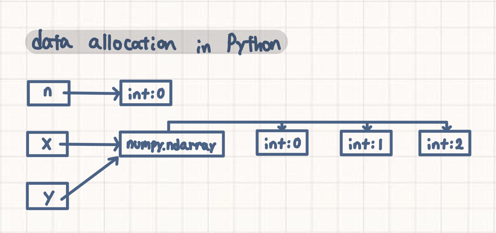

### 컨테이너(Container) 타입 변수  
Container 타입 변수란 list, tuple, dictionary, set과 같이 이름으로부터 실제 data에 접근하기 위해 index를 거쳐야 하는 data이다.

```python
x = np.array([0, 1, 2])

y = x

print(x)
print(y)
```

[0 1 2]  
[0 1 2]

```python
x[2] = 0

# x값이 변하면 y값도 변함
print(x)
print(y)
```

[0 1 0]  
[0 1 0]

```python
# copy 함수
x = np.array([0, 1, 2])
y = x.copy()

x[2] = 0

# copy 함수 이용 시 x값이 변해도 y값이 변하지 않음
print(x)
print(y)
```

[0 1 0]  
[0 1 2]

python에서 `n=0` 라는 코드를 작성하면, python 내부에서 우선 class가 int이고 값이 0인  `int:0` 라는 상자가 만들어지고, `n` 이라는 상자에는 `int:0` 를 가리키는 pointer가 저장된다.

`x = np.array([0, 1, 2])` 라는 코드를 작성하면, 우선 `int:0`, `int:1`, `int:2` 세가지 상자가 준비되고, 다음으로 `numpy.ndarray` class의 상자가 만들어지고, 이 상자에서 앞 3개의 상자로 향하는 pointer가 이어진다. 마지막으로 `x` 라는 상자가 만들어지고, `numpy.ndarray` 를 가리키는 pointer가 저장된다.

다음 `y = x` 라는 코드를 입력하면, 새로운 상자를 만들지 않고, x가 가리키는 상자를 y도 가리키게 설정해주기만 하면 된다.

따라서 x의 값이 바뀌면 y의 값도 같은 값으로 바뀌게 된다.
