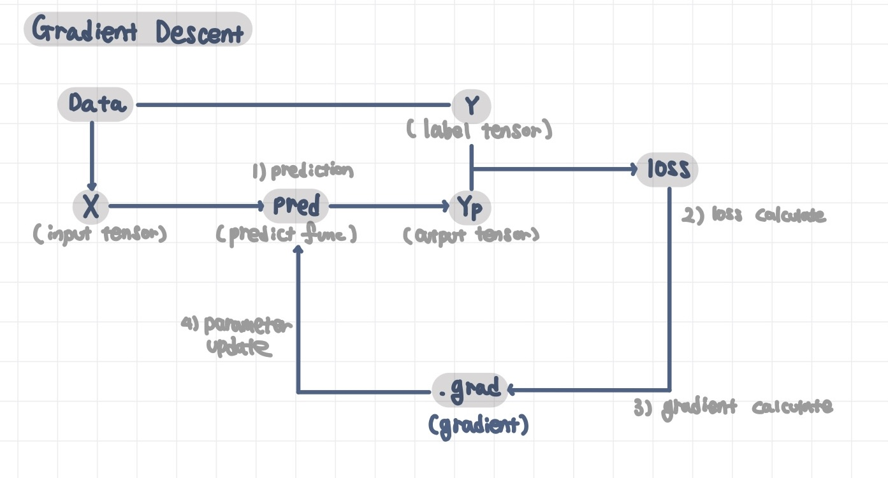

## Gradient Descent 경사하강법

Gradient Descent(경사 하강법)이란 가중치를 랜덤한 값에서부터 경사의 반대 방향으로 반복적으로 업데이트해 나가는 과정이다.
다시 말하자면, Gradient Descent는 손실, 즉 예측값과 실제값의 차이를 줄이는 것을 목표로  예측 함수의 파라미터 값들을 찾아나가는 과정이다.
Gradient Descent는 기본적으로 `Prediction(예측 계산)`, `Loss Calculate(손실 계산)`, `Gradient Calculate(경사 계산)`, `Parameter Update(파라미터 수정)` 과정의 반복이다.  
Gradient Descent은 다음과 같은 구조로 구현할 수 있다.


### 1. Prediction(예측 계산)

예측 계산이란 입력 데이터를 가지고 예측 값을 계산하는 과정이다.  
입력 텐서 $X$에 가중치(Weight) $W$를 곱하고 편향(Bias) $B$를 더해 간단한 1차 함수의 예측 함수를 만들 수 있다.  
수식으로 표현하면 다음과 같다.  
$Yp = W * X + B$ 

```python
X = torch.tensor(X).float()
Y = torch.tensor(Y).float()

# Weight, Bias
W = torch.tensor(1.0, requires_grad = True).float()
B = torch.tensor(1.0, requires_grad = True).float()

# predict function
def pred(X):
	return W * X + B

Yp = pred(X)
```

### 2. Loss Calculate(손실 계산)

loss(손실)이란 predict(예측) 값과 label(정답) 값의 차이를 의미한다.  
이 차이가 얼만큼 나는지를 평가하기 위해 loss function(손실 함수)을 사용한다.
loss function는 predict function(예측 함수)의 성질에 따라 적절한 값을 고른다.  
Regression 모델에서는 주로 `평균 제곱 오차(Mean Square Error)`함수를 선택한다.  
정답 값 $Y$와 예측 값 $Yp$가 완전히 일치할 경우 loss 값은 0이 되고, 두 값의 차가 크면 클수록 loss 값도 커진다.  

```python
def MSE(Yp, Y):
	loss = ((Yp - Y) ** 2).mean()
	return loss

loss = MSE(Yp, Y)
```

### 3. Gradient Calculate(경사 계산)

Gradient(경사)란 parameter의 변화에 따른 loss의 변화 정도를 측정한 것을 말한다.  

```python
loss.backward()
```

### 4. Parameter Update

Parameter Update는 gradient 값에 lr(learning rate, 학습률)을 곱해, 그만큼 $W$와 $B$ 값을 동시에 줄여나간다.

```python
lr = 0.01

with torch.no_grad():
	W -= lr * W.grad
	B -= lr * B.grad

	W.grad.zero_()
	B.grad.zero_()
```

gradient값을 계산하는 도중에 parameter(W, B)의 변화는 영향을 끼치므로 임의로 수정할 수 없다. 
따라서, `with torch.no_grad()` context를 설정해두면, 이 context 내부에서는 일시적으로 계산 그래프 생성 기능이 작동하지 않으며, parameter의 값을 수정할 수 잇다.

```python
W = torch.tensor(1.0, requires_grad = True).float()
B = torch.tensor(1.0, requires_grad = True).float()

num_epochs = 500

lr = 0.01

history = np.zeros((0, 2))

for epoch in range(num_epochs):
	Yp = pred(X)

	loss = MSE(Yp, Y)

	loss.backward()

with torch.no_grad():
	W -= lr * W.grad
	B -= lr * B.grad

	W.grad.zero_()
	B.grad.zero_()

if (epoch % 10 == 0):
	item = np.array([epoch, loss.item()])
	history = np.vstack((history, item))
	print(f'epoch = {epoch} loss = {loss:.4f}')
```

### Optimizer(최적화 함수)

Optimizer(최적화 함수)를 이용한다면, parameter($W$와 $B$) 값을 직접 변경하지 않아도 된다.

```python
W = torch.tensor(1.0, requires_grad = True).float()
B = torch.tensor(1.0, requires_grad = True).float()

num_epochs = 500

lr = 0.01

import torch.optim as optim
optimizer = optim.SGD([W, B], lr=lr)

history = np.zeros((0, 2))

for epoch in range(num_epochs):
	Yp = pred(X)

	loss = MSE(Yp, Y)

	loss.backward()

	optimizer.step()

	optimizer.zero_grad()

if (epoch % 10 == 0):
	item = np.array([epoch, loss.item()])
	history = np.vstack((history, item))
	print(f'epoch = {epoch} loss = {loss:.4f}')
```

optimizer에 `momentum` 옵션을 추가하여 최적화 함수를 tunning 할 수 있다.

```python
optimizer = optim.SGD([W, B], lr=lr, momentum=0.9)
```

### Momentum

Momentum(관성)이란, 각 parameter를 update하는 과정에서, 이전 gradient의 값을 일부 반영한다.

$s^t_i = \alpha s^{t-1}_i + (1-\alpha )\frac{\delta E^t}{\delta w_i} \\  \Delta w_i^t = -\eta s^t_i$

online learning이나 mini-batch 기법에서 효과적이다. 다만, 추가 메모리가 필요하다($s_i$개수만큼)

### (Full) Batch Gradient Descent

- 전체 학습 데이터의 gradient를 평균내어 GD의 매번의 step마다 적용

### Stochastic Gradient Descent

- Dataset이 매우 큰 경우, 매번 전체 학습 데이터를 연산하면 메모리의 사용량이 늘어난다
- 따라서, 하나의 데이터를 골라 인공신경망에 학습시킨다.
- Full Batch와는 다르게 확률론적, 불확실성의 개념을 도입하였다

```python
# 1. Take an Example
# 2. Feed it to Neural Network
# 3. Calculate it’s gradient
# 4. Use the gradient we calculated in step 3 to update the weights
# 5. Repeat steps 1–4 for all the examples in training dataset
```

SGD의 장점

- SGD는 빠른 속도로 수렴한다
- SGD는 local optima에 빠질 위험이 적다

**local optima** : error의 global 한 minimum지점이 아닌 특정 구간 내에서 minimum한 지점

### mini-Batch Gradient Descent

- Batch GD와 SGD의 절충안으로, 전체 학습 데이터를 minibatch로 나누어, GD를 진행한다

```python
# 1. Pick a mini-batch
# 2. Feed it to Neural Network
# 3. Calculate the mean gradient of the mini-batch (batch GD의 특성 적용)
# 4. Use the mean gradient we calculated in step 3 to update the weights
# 5. Repeat steps 1–4 for the mini-batches we created
```

minibatch GD 장점

- SGD에 비해 local optima에 빠질 위험이 줄어든다
- batch를 나누므로 병렬처리 시 유리하다.
- Batch GD보다 메모리 사용을 절약할 수 있다.

mini-Batch GD와 SGD는 최적화가 진행되면서 fluctuating 곡선을 보인다 → 매번 다른 gradient 평균을 적용하면서 최적화를 진행하기 때문

