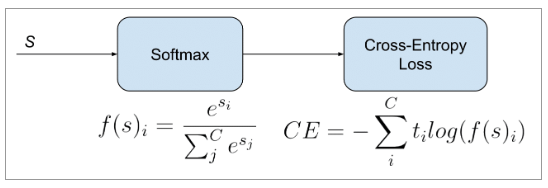
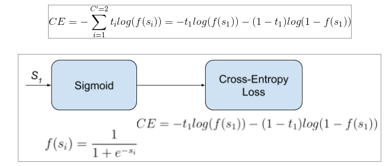

## Cross-Entropy Loss

$CE = -\sum_t^kr^tlog(y^t)$, $r^t:$ 실체 값(label), $y^t:$예측 값(확률)

**Cross-Entropy Loss in Binary Classification**

$C'E = -\sum_t^{k=2}r^tlog(y^t)=-r^1log(y^1)-(1-r^1)log(1-y^1)$

**Example)**  
데이터의 개수가 n개라면, maximum likelihood function은 $\sum_{i=1}^n \left\{r^t_ilog(y^t_i)+(1-r^t_i)log(1-y^t_i) \right\}$ 가 되고, 손실 함수는 값을 작게 하는 것을 목표로 하므로, 여기에 -1을 곱하고, 데이터 개수로 나눈 평균을 취한  $-\sum_{i=1}^n \left\{r^t_ilog(y^t_i)+(1-r^t_i)log(1-y^t_i) \right\} / \ n$ 이 손실 함수가 된다.

### Categorical Cross-Entropy Loss

Softmax activation 뒤에 Cross-Entropy Loss를 붙인 형태로 주로 사용하기 때문에 Softmax loss라고도 불린다. → Multi-class classfication에 사용된다

Classification 문제에서는 MSE(Mean Square Error)보다 CE Loss가 더 빨리 수렴한다는 사실이 알려져있다. 따라서 Multi class에서 하나의 클래스를 구분할 때 softmax와 CE loss의 조합을 많이 사용한다.



```python
torch.nn.CrossEntropyLoss
```

### Binary Cross-Entropy Loss

Sigmoid activation 뒤에 Cross-Entropy Loss를 붙인 형태로 주로 사용하기 때문에 Sigmoid CE loss라고도 불린다. → Multi-label classification에 사용된다.

$C'E = -\sum_t^{k=2}r^tlog(y^t)=-r^1log(y^1)-(1-r^1)log(1-y^1)$



```python
torch.nn.BCEWithLogitsLoss
```