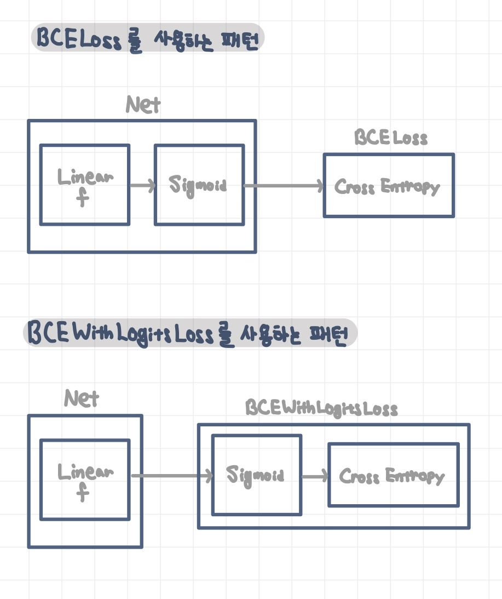

---
title:  "BCELoss vs BCEWithLogitsLoss"
metadate: "hide"
date : 2023-10-13 18:00:00 +0900
categories: [ ML/DL ]
image: "/assets/images/bceloss-vs-bcewithlogitsloss.png
.png" 
visit: "https://github.com/All4Nothing"
---  
## BCELoss vs BCEWithLogitsLoss
Logistic regression 문제에서 loss function으로 `BCELoss`와 `BCEWithLogitsLoss`를 사용하는 패턴의 코드는 다음과 같다.

```python
# BCELoss Pattern
class Net(nn.Module):
    def __init__(self, n_input, n_output):
        super().__init__()
        self.l1 = nn.Linear(n_input, n_output)
        self.sigmoid = nn.Sigmoid()
        self.l1.weight.data.fill_(1.0)
        self.l1.bias.data.fill_(1.0)

    def forward(self, x):
        x1 = self.l1(x)
        x2 = self.sigmoid(x1)
        return x2
···
lr = 0.01
net = Net(n_input, n_output)
criterion = nn.BCELoss()
optimizer = optim.SGD(net.parameters(), lr=lr)
···
```
```python
# BCEWithLogitsLoss Pattern
class Net(nn.Module):
    def __init__(self, n_input, n_output):
        super().__init__()
        self.l1 = nn.Linear(n_input, n_output)
        self.sigmoid = nn.Sigmoid()
        self.l1.weight.data.fill_(1.0)
        self.l1.bias.data.fill_(1.0)

    def forward(self, x):
        x1 = self.l1(x)
        return x1
···
lr = 0.01
net = Net(n_input, n_output)
criterion = nn.BCEWithLogitsLoss()
optimizer = optim.SGD(net.parameters(), lr=lr)
···
```
`BCELoss` 패턴과 달리 `BCEWithLogitsLoss` 패턴에서는 loss funtion으로 `BCELoss`가 아닌 `BCEWithLogitsLoss`를 사용하였다는 점도 있지만, `BCEWithLogitsLoss` 패턴에서는 모델(Net)에서 Sigmoid 함수를 호출 하는 부분이 생략되어있다.

### BCEWithLogitsLoss
`BCEWithLogitsLoss` 함수는, sigmoid 함수 뒤에 cross-entropy 함수를 호출하는 기능을 포함하고 있다.  


gradient 계산에서 사용하는 loss는 loss function 함수와 predict 함수(모델)의 합성함수이다. 합성 함수로 보았을 때, `BCELoss`를 사용하는 패턴과 `BCEWithLogitsLoss`를 사용하는 패턴은 완전히 동일하다. 따라서, 합성함수의 관점에서는 어떤 패턴을 사용하는 지와 상관 없이 동일한 parameter를 학습한다.  
한 가지 주의해야 할 점은, 대상 분류의 기준값이 `BCELoss`를 사용하는 패턴에서는 '모델의 output이 0.5보다 큰가'(output이 0.5보다 크면 label을 1로 예측)인 반면에, `BCEWithLogitsLoss`에서는 '모델의 output이 0보다 큰가'이다. 그 이유는, `BCELoss`에서는 모델의 output이 `sigmoid`값 이지만, `BCEWithLogitsLoss`에서는 모델의 output이 `sigmoid`의 input값이기 때문이다. (`sigmoid`는 input이 0보다 큰 경우 output값이 0.5보다 크기 때문)  
```python
# BCELoss Pattern
predicted = torch.where(outputs < 0.5, 0, 1)
```
```python
# BCEWithLogitsLoss
predicted = torch.where(outputs < 0.0, 0, 1)
```

파이토치는 이러한 `BCEWithLogitsLoss`와 같은 새로운 패턴을 사용해서 구현할 것을 장려하고 있다. 그 이유는 `BCEWithLogitsLoss`와 같은 패턴에 '(sigmoid 함수 등이 포함하는) 지수 함수와 (cross-entropy 함수 등이 포함하는) 로그 함수를 독립적으로 계산하면 그 결과가 불안정해지기 쉬우므로, 되도록 한 쌍으로 계산해야 한다.'는 정책을 추구하는 파이토치의 철학이 반영되어 있기 때문이다.