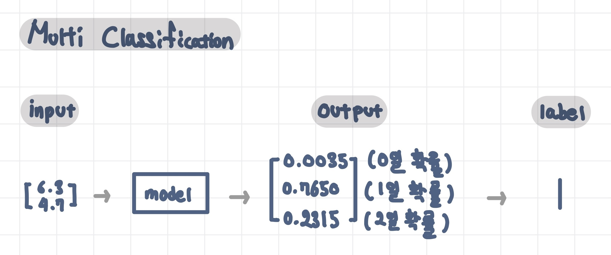
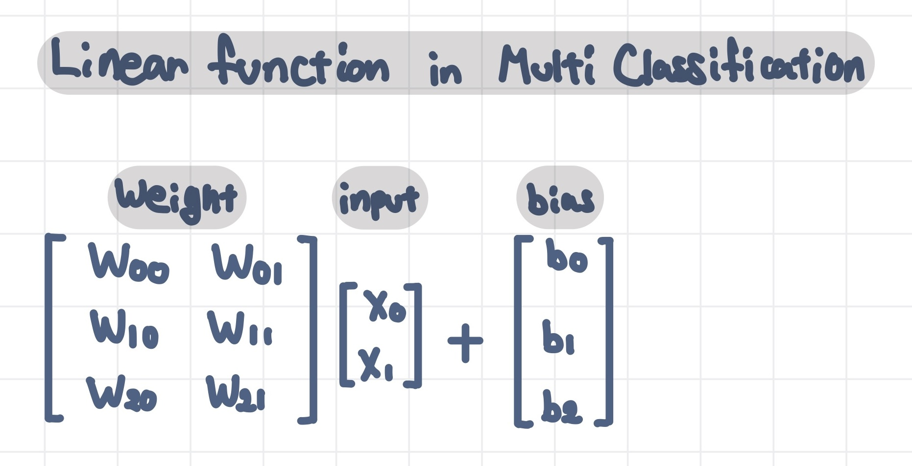
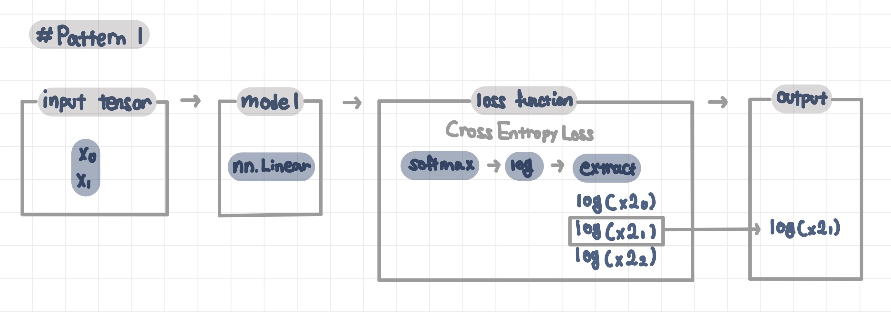
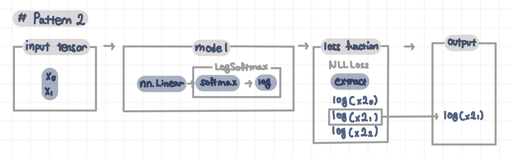

---
title:  "Multi Classification"
date : 2023-10-21 18:00:00 +0900
categories: [ Concepts ]
image: "/assets/images/multi-classification.png" 
visit: "https://github.com/All4Nothing"
---  
## Multi Classification 다중 분류

`Multi classfication` 모델을 이해해보기 위해 `binary classification`의 차이를 먼저 살펴보자.
`binary classification` 모델의 출력은 1차원이지만, `Multi classfication` 모델에서는 출력이 `N` 차원이다(`N` : 분류하려는 그룹의 개수).
`binary classification`에서는 activation 함수로 `sigmoid`를 사용하지만, `Multi classfication`에 서는 `softmax`를 사용한다.
`loss function`으로는 binary와 multi classification 모두
`cross-entropy` 함수를 사용하지만
형식에는 차이가 있다.

### Multi Classifier 다중 분류기

Binary classification에서는 정답이 1 또는 0 이어서, 예측값을 확률값(1차원)으로 정의할 수 있다(1에 가까울 확률). 그러나 multi classification에서는 정답이 3개 이상일 경우, 예측값을 확률값(1차원)으로 정의할 수 없다. 따라서, multi classification에서는 모델의 출력 값을 1차원이 아닌 `N`차원으로 정의하고, N개의 `classifier`가 각각의 그룹에 속할 화률을 예측한다. N개의 값 중 확률이 가장 큰 값의 label이 모델의 예측값이 된다.

출력이 1차원에서 N차원으로 늘었으므로, 예측 수 또한 N개가 필요하다. 즉, Binary classification에서는 모델의 parameter가 `weight vector`였으나, multi classification에서는 `weight metrics`를 사용한다.

다중 분류에서 cross-entropy 함수는 모든 요소들에 대해 log를 취하고, 정답 요소만을 골라낸다. 따라서, loss 함수로 넘겨줄 두 번째 인수(정답)은 반드시 정숫값(ex. 정답이 0, 1, 2 중 어느 것인지)으로만 이뤄진 값이어야 한다.
파이토치에서 multi classifcation 모델은 2가지 패턴으로 구현할 수 있다.
패턴 1

패턴 2

파이토치에서는 패턴1을 표준으로 생각한다. CrossEntropyLoss가 Softmax와 NLLLoss 합수 를 모두 포함하는 구조인 이유는, '로그 함수를 독립적으로 사용하면 동작이 불안정하기 때 문에, 반드시 지수 함수(sigmoid 함수나 Softmax 함수)를 함께 사용해야 한다'는 파이토치 의 정책이 담긴 철학 때문이다.

- multi classifcation에서 예측 label 얻는 법
원래라면 Softmax 함수의 출력값(확률값) 중 가장 큰 값을 출력한 classificer의 number가 예측 label이지만, Softmax는 input값 중 가장 큰 값이 output에서도 유지되므로, Softmax의 input값 중 가장 큰 값을 찾아도 된다.

```python
label = torch.max(output, 1)[1] # torch.max는 최댓값(value)와 index 반환
```