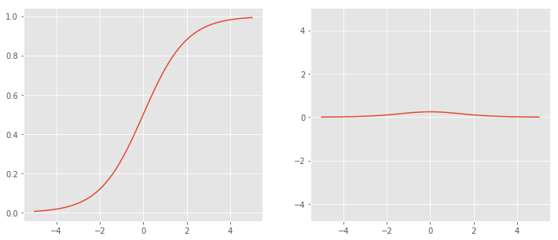
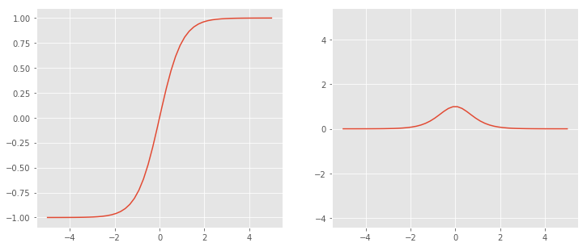
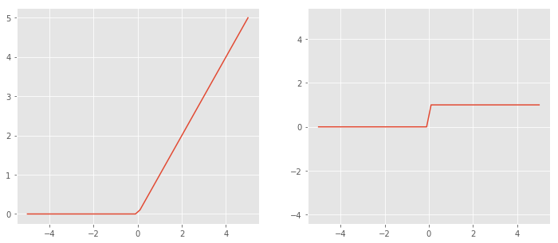

---
title:  "Activation Function"
date : 2023-11-18 20:00:00 +0900
categories: [ Concepts ]
image: "/assets/images/activation-function.png" 
---  

### Activation Function 활성화 함수

- 단순히 선형 함수들을 합성해 놓기만 한 예측함수는, 결국 한 개 층의 선형 함수를 쓴 예측함수와 같다.
- ‘비선형 함수’로 불리는 활성화 함수를 선형 함수의 사이에 넣어야 깊은 층을 가진 딥러닝 모델이 의미를 갖게 되는 것이다.
- 즉 non-linear 함수(activation 함수)에 linear 함수를 합성해 non-linear하게 만드는 것이 목적이다.

### Activation 3가지 분류

**Binary Step Function**

- 임계치를 기준으로 출력
- perceptron 퍼셉트론 알고리즘에서 활성화 함수로 사용
    
    $\sigma(x) = \left\{\begin{matrix}
     0, x \leq 0\\1, x>0
    \end{matrix}\right.$
    
- 다중 분류 문제에서 다중 출력을 할 수 없다.

**Linear activation function**

- 선형 활성화 함수
    
    $h(x) = cx, c \ is \ constant$
    
- 다중 출력이 가능
- backpropagtion 사용 불가 : backpropagtion은 미분값을 통해 손실값을 줄여나가는데, 미분값이 상수이기에 입력값과 상관없는 결과를 얻는다. 즉, 예측과 가중치에 대한 상호관계에 대한 정보를 얻을 수 없다
- 은닉층이 무시됨 : 활성화 함수를 여러층에 사용하여 필요한 정보를 얻으려는데, 선형함수를 여러번 사용하는 것은 마지막에 선형함수를 한번 쓰는 것과 같다. $h(x) = cx, h(h(h(x))) = c'x$

**Non-linear activation function**

- 활성화 함수는 주로 비선형 함수를 사용한다.
- 신경망 모델에서는 입력과 출력간의 복잡한 관계를 만들어 필요한 정보를 얻는다 ← 대부분 비선형 함수 사용. 특히 비정형적인 데이터에 특히 유용하다 (이미지, 영상, 음성 등의 고차원 데이터)
- 입력과 관련있는 미분값을 얻으며 back propagation이 가능하다
- 심층 신경망을 통해 더 많은 중요 정보를 얻을 수 있다.

### Non-linear Activation 종류

**Sigmoid**

- logistic으로도 불리는 s자 형태를 띄는 함수
    
    
    *Left : **σ**(x), Right : **σ’(x)***
    
    $\sigma(x) = \frac{1}{1+exp(-x)}$
    
    $\sigma'(x) = \sigma(x)(1-\sigma(x))$
    
- 장점
    - 유연한 미분값을 가진다
    - 출력값의 범위가 (0, 1)로 제한되어, exploding gradient 문제를 방지한다
    - 미분 식이 단순한 형태를 가진다
- 단점
    - Vanishing Gradient 문제가 발생한다.
        - $\frac{\sigma(x) + (1-\sigma(x))}{2}=\frac{1}{2} \geq \sqrt{\sigma(x)(1-\sigma(x))}$  → $\sigma'(x)$값의 범위가 $(0, \frac{1}{4})$임. 따라서 back propagation시 입력층에 가까운 층일수록 gradient가 0에 수렴한다. → 입력층에 가까운 층일수록 weight가 업데이트 되지 않는 문제가 생긴다.(gradient값이 작으므로 덜 기여한다고 생각)
            - 입력층의 gradient를 알기위해서는 출력층에 가까운 층의 gradient를 곱해나간다(Chain Rule). gradient값이 1보다 작으므로 곱할수록 점점 작은 gradient값이 출력됨.
    - 출력이 zero centered가 아니다.
        - gradient값이 양수여서 데이터가 평균 중심으로 고르게 분포하지 않고 한쪽으로 치우친다.
    - exp연산은 비용이 크다
    

**Tanh**

- tanh 또는 hyperbolic tangent 함수로 쌍곡선 함수이다. 시그모이드 변형을 이용해 사용가능하다.
    
    
    *Left : **σ**(x), Right : **σ’(x)***
    
- $tanh(x) = 2\sigma(2x)-1$
$tanh(x) = \frac{e^x - e^{-x}}{e^x + e^{-x}}$
$tanh'(x) = 1 - tanh^2(x)$

- 장점
    - zero centered
    - sigmoid 장점과 같다
- 단점
    - zero centered문제를 제외한 sigmoid 단점과 같다
    
     
    

**ReLU**

- Rectified Linear Unit  개선 선형 함수.
    
    
    *Left : **σ**(x), Right : **σ’(x)***
    
    $f(x) =max(0, x)$
    $f'(x) = \left\{\begin{matrix}
     0, x \leq 0\\1, x>0
    \end{matrix}\right.$
    
- 실제 뇌와 같이 모든 정보에 반응하는 것이 아닌 일부 정보에 대해 무시와 수용을 통해 보다 효율적인 결과를 낸다
- CNN에서 좋은 성능을 보였고, 딥러닝에서 가장 많이 사용하는 활성화 함수 중 하나이다
- 장점
    - 연산이 매우 빠르다
    - 비선형이다
- 단점
    - Dying ReLU
        - 입력값이 0 또는 음수일 때, gradient 값은 0이된다. → 학습을 하지 못한다.

**Leaky ReLU**

*https://deeplearninguniversity.com/*

$y = f(x) = max(kx, x)$

- ReLU와 달리 input이 음수인 경우, output을 완만하게 만든다.

**Softmax**

- 입력받은 값을 0에서 1사이의 값으로 모두 정규화하며, 출력 값이 여러개이다. 출력 값의 총합은 항상 1이 된다.
    
    $f_i(\vec x) = \frac {e^{x_i}}{\sum_{j=1}^J e^{x_j}}$
    
- 입력 중에서 가장 큰 값의 확률이 가장 크도록 출력한다. 그러나 다른 항목들의 확률값도 완전히 0이 되진 않으며, 어느정도는 값이 존재한다. 극단적이지 않도록 소프트하게 최댓값을 낸다는 것이 이름의 유래다.
- 출력층에 많이 사용한다
- 장점
    - 다중 클래스 문제에 적용 가능하다
    - 정규화 기능을 가진다
- 단점
    - 지수함수를 사용하여 오버플로 발생이 가능하다. → 분모 분자에 $C$를 곱해 방지

### 그 외

- Parametric ReLU (PReLU), ELU, Swish, Softplus, Softsign, Thresholded ReLU, Maxout 등

*https://subinium.github.io/introduction-to-activation/*