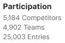

---
title:  "Get to TOP 5.9% in House Price Prediction"
date : 2023-11-17 18:00:00 +0900
categories: [ Kaggle ]
image: "/assets/images/get-to-top-10%-house-price-prediction.png" 
---  
## Get to TOP 10% in House Price Prediction
LogisticRegression의 대표적인 Kaggle 대회인 'House Price Prediction'에 참가해, Leaderboard Top 10%에 들기 위해 다양한 테크닉들을 사용해보고 기록해보고자 한다.

> *House Prices - Advanced Regression Techniques*  
> https://www.kaggle.com/competitions/house-prices-advanced-regression-techniques/

### Day 1 @ 2023.10.26
**EDA**
- draw `Correlation matrix` (heatmap style)
- draw 'SalePrice' correlation matrix(`zoomed heatmap style`)
- draw `Scatter plots` between 'SalePrice' and correlated variables
- dealing with `Missing data` with `drop`
- dealing with `Outliers` with `Univariate analysis` & `Bivariate analysis`
- make data `Normally distributed` with `transformations`
- convert `categorical variable into dummy`

[Kaggle Code](https://www.kaggle.com/code/outoftime/house-price-prediction-eda)

### Day 2 @ 2023.10.27
**use XGBoost**
- XGBRegressor
- model tunning with early stopping

> **Score : 0.14547**  
> **Rank : 2128**

[Kaggle Code](https://www.kaggle.com/code/outoftime/xgboost-with-eda)

### Day 3 @ 2023.12.23

- A*pply $log(1+x)$ transformation to skewed data*
- Combine train and test features in order to apply the feature transformation pipeline to the entire dataset
- Fill missing value
- Fix skewed features
- Encode categorical features → **Score :** `0.1432`
- Scale predictions → **Score :** `0.14309`

- Fine Tune XGBoost → **Score :** `0.14284`
- blend XGBoost + SVR(Support Vector Regressor) → **Score :** `0.12657`
- blend XGBoost + SVR(Support Vector Regressor) + Ridge Regressor → **Score :** `0.12387`
- blend XGBoost + SVR(Support Vector Regressor) + Ridge Regressor + LGBM → **Score :** `0.12173`
- blend XGBoost + SVR(Support Vector Regressor) + Ridge Regressor + LGBM + Gradient Boosting Regressor + Random Forest Regressor → **Score :** `0.12173`
- blend XGBoost + SVR(Support Vector Regressor) + Ridge Regressor + LGBM + Gradient Boosting Regressor + Random Forest Regressor + Stack up all the models above, optimized using xgboost → **Score :** `0.12155`

> **Score : 0.12155**
> **Rank : 308**

[Kaggle Code](https://www.kaggle.com/code/outoftime/how-i-made-top-0-3-on-a-kaggle-competition)

### Conclusion

**Top 5.9%**