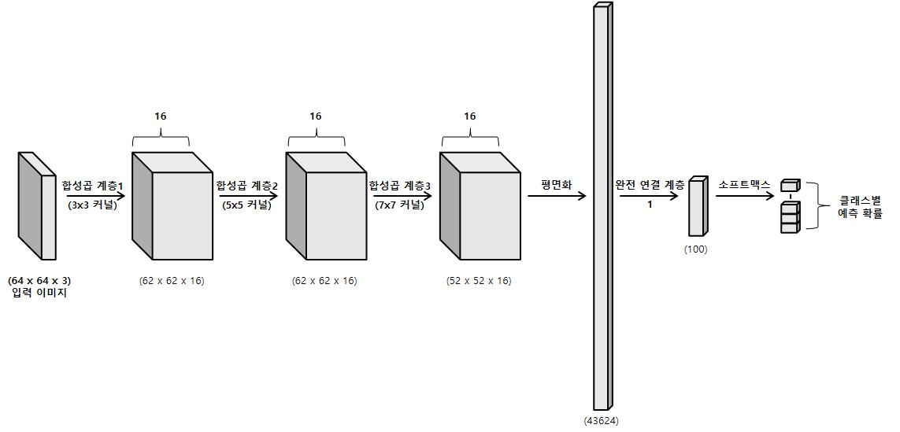
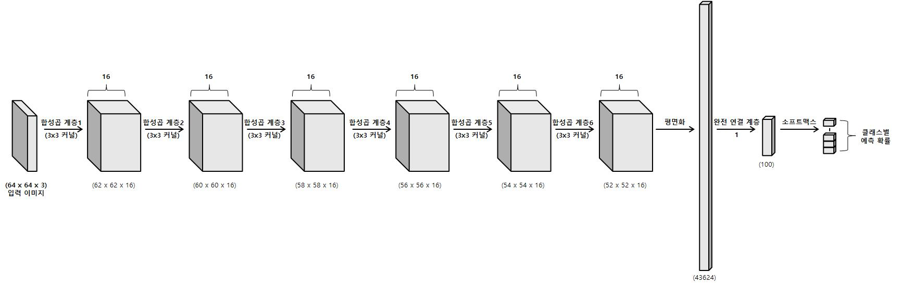
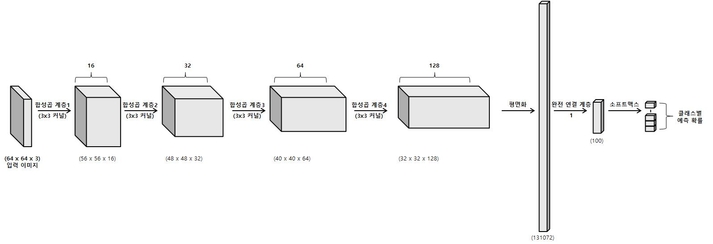
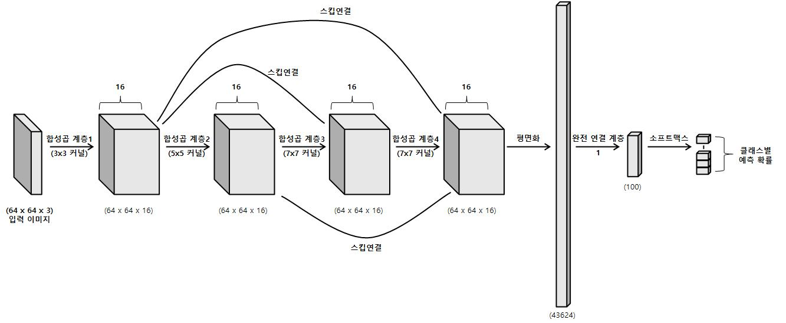

---
title:  "Variate CNN"
metadate: "hide"
date : 2023-11-18 24:00:00 +0900
categories: [ ML/DL ]
image: "/assets/images/variate-cnn.png" 
---  
## Variate CNN
다양한 CNN 모델들의 구조를 살펴보자.

- 공간 탐색 기반 CNN : 공간 탐색은 입력 데이터에서 다양한 수준의 시각적 특징을 탐색하기 위해 다양한 커널 크기를 사용하는 것을 기본 아이디어로 삼는다.

- 깊이 기반 CNN : 여기서 깊이란 신경망 깊이, 즉 계층 수를 말한다. 따라서 여기는 고도로 복합적인 시각 특징을 추출하기 위해 여러 개의 합성곱 계층을 두어 CNN 모델을 생성한다.

- 너비 기반 CNN : 너비는 데이터에서 채널이나 특징 맵 개수, 또는 데이터로부터 추출된 특징 개수를 말한다. 따라서 너비 기반 CNN은 다음 그림에 나온 것처럼 입력 계층에서 출력 계층으로 이동할 때 특징 맵 개수를 늘린다.

- 다중 경로 기반 CNN : 지금까지 앞선 세 가지 유형의 아키텍처는 계층 간 단조롭게 연결돼 있다. 즉, 연이은 계층 사이에 직접 연결만 존재한다. 다중 경로 기반 CNN은 연이어 있지 않은 계층 간 숏컷 연결(shortcut connections) 또는 스킵 연결(skip connections) 등의 방식을 채택한다. 다중 경로 아키텍처의 핵심 장점은 스킵 연결 덕분에 여러 계층에 정보가 더 잘 흐르게 된다는 것이다. 이는 또한 너무 많은 손실 없이 경사가 입력 계층으로 다시 흐르도록 한다.

p.63 내용 쓰기
변천사

### LeNet
p.65 구조 사진

### AlexNet

### VGG

### GoogLeNet

### Inception v3

### ResNet

### DenseNet

### EfficientNet
