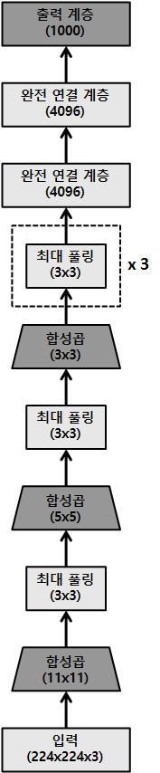
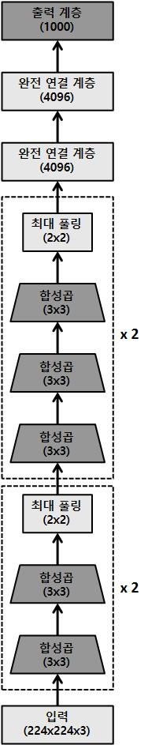
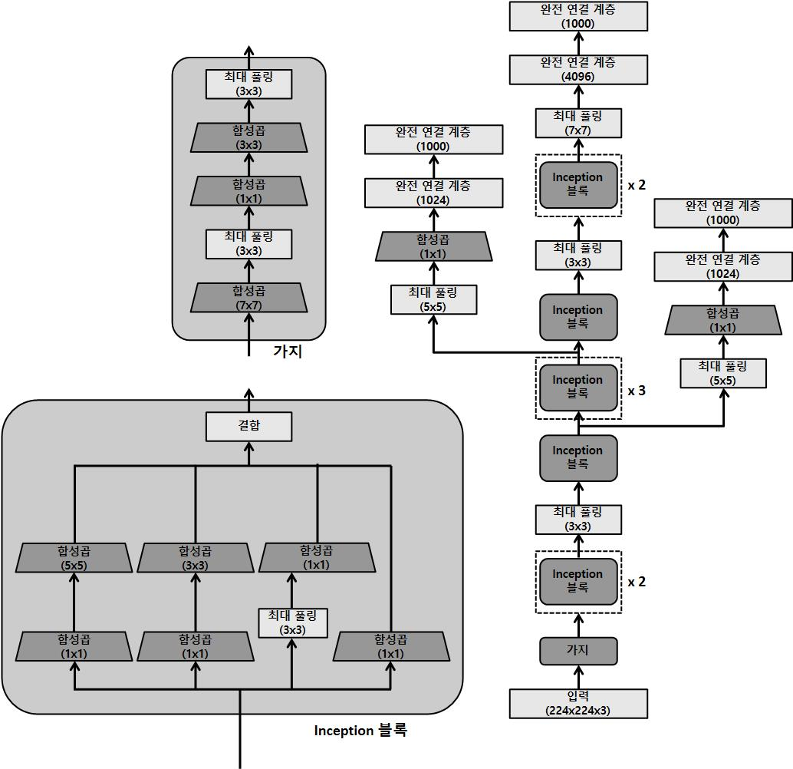
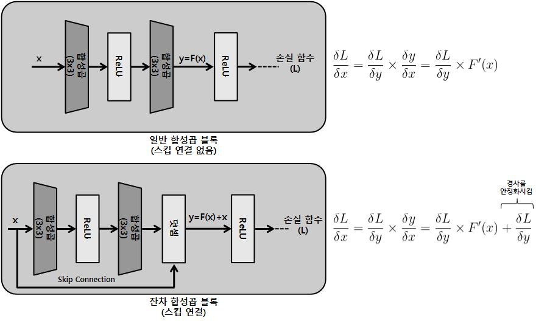
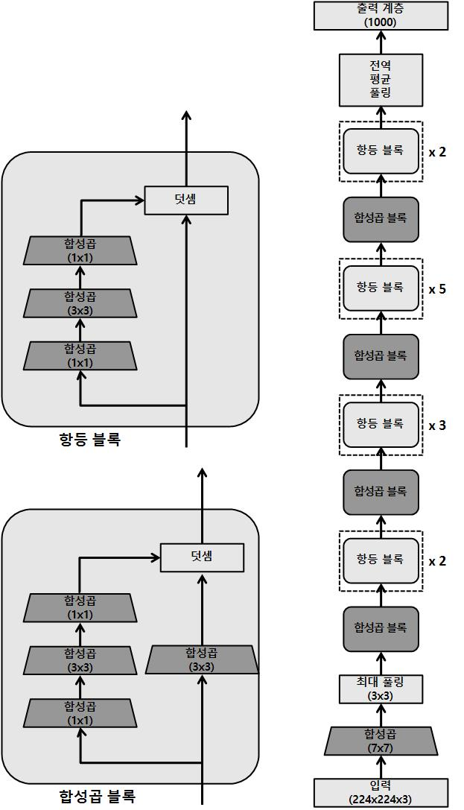
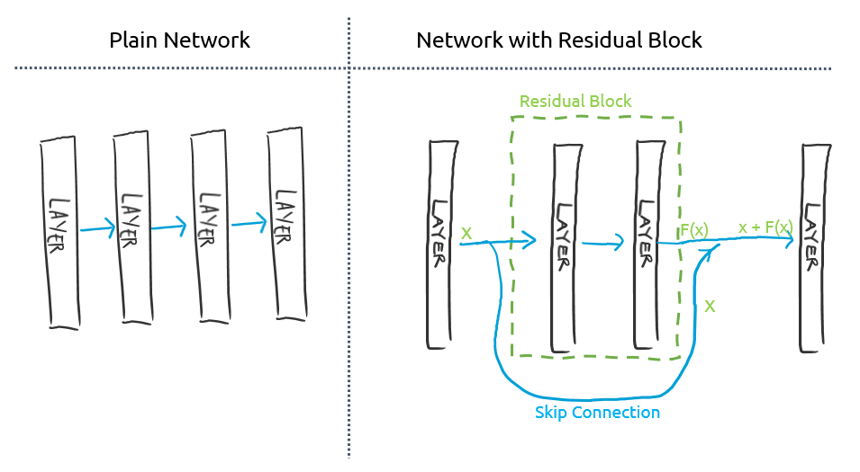
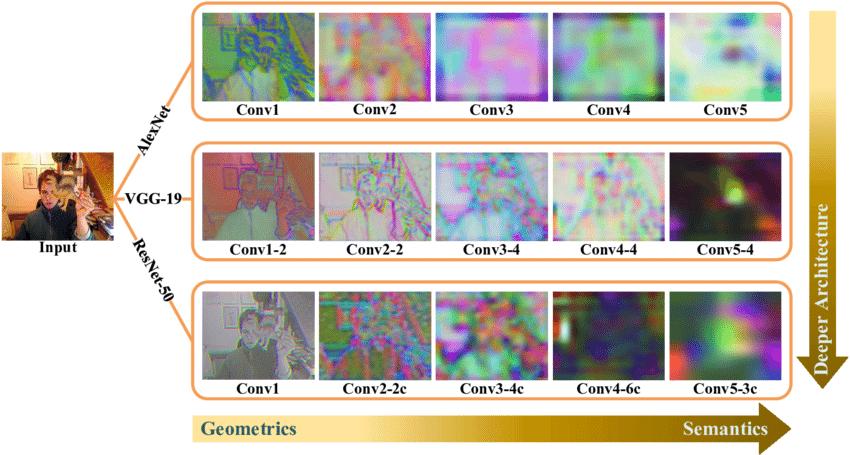
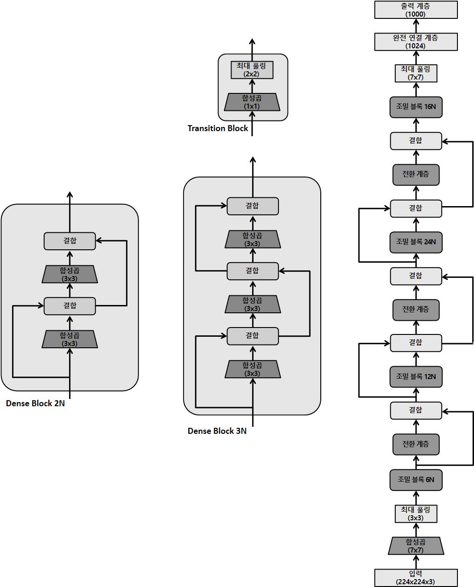

---
title:  "Variate CNN"
metadate: "hide"
date : 2023-11-18 24:00:00 +0900
categories: [ Concepts ]
image: "/assets/images/variate-cnn.png" 
---  

## Variate CNN
다양한 CNN 모델들의 구조를 살펴보자.

- 공간 탐색 기반 CNN : 공간 탐색은 input 데이터에서 다양한 수준의 시각적 특징을 탐색하기 위해 다양한 커널 크기를 사용한다.


- 깊이 기반 CNN : 여기서 깊이란 신경망 깊이, 즉 layer 수를 말한다. 따라서 여기는 고도로 복합적인 시각 특징을 추출하기 위해 여러 개의 convolution layer를 두어 CNN 모델을 말한다.


- 너비 기반 CNN : 너비는 데이터에서 채널이나 특징 맵 개수, 또는 데이터로부터 추출된 특징 개수를 말한다. 따라서 너비 기반 CNN은 다음 그림에 나온 것처럼 입력 계층에서 출력 계층으로 이동할 때 특징 맵 개수를 늘린다.


- 다중 경로 기반 CNN : 지금까지 앞선 세 가지 유형의 아키텍처는 layer들이 순차적으로 연결되어 있다. 즉, 연이은 layer 사이에 직접 연결만 존재한다. 다중 경로 기반 CNN은 연이어 있지 않은 layer 간 숏컷 연결(shortcut connections) 또는 스킵 연결(skip connections) 등의 방식을 채택한다. 다중 경로 아키텍처의 핵심 장점은 스킵 연결 덕분에 여러 계층에 정보가 더 잘 흐르게 된다는 것이다. 이는 또한 너무 많은 손실 없이 gradient가 입력 계층으로 다시 흐르도록 한다.


### LeNet


*https://cdn.analyticsvidhya.com*
```python
class LeNet(nn.Module):
	def __init__(self):
		super(LeNet, self).__init__()
		# 3 input channel, 6 output feature map, 5x5 convolution kernel
		self.cn1 = nn.Conv2d(3, 6, 5)
		# 6 input channel, 16 output feature map, 5x5 convolution kernel
		self.cn2 = nn.Conv2d(6, 16, 5)
		self.fc1 = nn.Linear(16 * 5 * 5, 120)
		self.fc2 = nn.Linear(120, 84)
		self.fc3 = nn.Linear(84, 10)

	def forward(self, x):
		x = F.relu(self.cn1(x))
		x = F.max_pool2d(x, (2, 2))
		x = F.relu(self.cn2(x))
		x = F.max_pool2d(x, (2, 2))
		x = x.view(-1, self.flattened_features(x))
		x = F.relu(self.fc1(x))
		x = F.relu(self.fc2(x))
		x = self.fc3(x)
		return x

	def flattened_features(self, x):
		size = x.size()[1:]
		num_feats = 1
		for s in size:
			num_feats *= s
		return num_feats
```

### AlexNet

AlexNet은 LeNet 모델의 아키텍처를 증가시켜 만든 후속 모델이다.

- 계층 수 증가 (LeNet : 5 layer → 8 layer)
- 매개변수 수 증가 (LeNet : 60K parameters → 60M parameters)
- 최대 풀링 방식 (LeNet : AvgPooling → MaxPooling)
- 많은 양의 데이터셋 (LeNet : $\alpha$MB → 100GB+)

아키텍처는 convolution layer를 순차적으로 쌓은 다음, 마지막 출력까지 완전 연결 계층을 잇는 LeNet 방식을 따른다.



```python
class AlexNet(nn.Module):
	def __init__(self, number_of_classes):
		super(AlexNet, self).__init__()
		self.feats = nn.Sequential(
			nn.Conv2d(in_channels = 3, out_channels = 64, kernel_size = 11, stride = 4, padding = 5),
			nn.ReLU(),
			nn.MaxPool2d(kernel_size = 2, stride = 2),
			nn.Conv2d(in_channels = 64, out_channels = 192, kernel_size = 5, padding = 2),
			nn.ReLU(),
			nn.MaxPool2d(kernel_size = 2, stride = 2),
			nn.Conv2d(in_channels = 192, out_channels = 384, kernel_size = 3, padding = 1),
			nn.ReLU(),
			nn.Conv2d(in_channels = 384, out_channels = 256, kernel_size = 3, padding = 1),
			nn.ReLU(),
			nn.Conv2d(in_channels = 256, out_channels = 256, kernel_size = 3, padding = 1),
			nn.ReLU(),
			nn.MaxPool2d(kernel_size = 2, stride = 2),
		)
		self.clf = nn.Linear(in_features = 256, out_features = number_of_classes)

	def forward(self, inp):
		op = self.feats(inp):
		op = op.view(op.size(0), -1)
		op = self.clf(op)
		return op
```

### VGG

VGG는 AlexNet 아키텍처 위에 layer를 더 많이 쌓고 더 작은 크기의 convolution kernel(2x2, 3x3)을 택한다.

- 13 layer
- 138M parameters
    - 11x11, 5x5, 3x3 convolution kernel → 3x3, 2x2 convolution kernel

VGG 아키텍처는 13개, 16개, 19개 계층으로 구성된 **VGG13, VGG16, VGG19** 가 있다. 또 다른 변형으로는 **VGG13_bn, VGG16_bn, VGG19_bn**이 있는데 여기에서 bn은 이 모델이 batch normalizaiton layer로 구성됨을 뜻한다.



### GoogLeNet

GoogLeNet은 inception 모듈이라고 하는 parallel convolution layer의 모듈로 구성된 근본적으로 다른 유형의 CNN 아키텍처로 등장했다.

이 때문에 GoogLeNet은 **Inception v1**이라고 한다

- **Inception 모듈** - 여러 병렬 parallel convolution layer로 구성된 모듈
- 모델 매개변수 개수를 줄이기 위해 **1x1 convolution**을 사용
- 완전 연결 계층 대신 **global average pooling**을 사용해 overfitting을 줄임
- 훈련 시 regularization 및 gradient 안정성을 위해 **보조 분류기**(auxiliary classifier)를 사용
- 22 layer
- 138M → 5M parameters

**Inception 모듈**

이 모델의 가장 중요한 점은, 여러 convolution layer가 병렬로 실행되어 최종적으로 단일 출력 벡터를 생성하기 위해 연결되는 convolution 모듈을 개발했다는 것이다.

이 parallel convolution layer는 1x1, 3x3, 5x5에 이르기까지 다양한 크기의 커널을 사용해 동작한다.

아이디어는 이미지에서 여러 layer의 시각 정보를 추출하는 것이다.

이 convolution 외에 3x3 max pooling layer는 다른 layer의 특징 추출을 더한다.



```python
class InceptionModule(nn.Module):
def __init__(self, input_planes, n_channels1x1, n_channels3x3red, n_channels3x3, n_channels5x5red, n_channels5x5, pooling_planes):
        super(InceptionModule, self).__init__()
# 1x1 convolution branchself.block1= nn.Sequential(
            nn.Conv2d(input_planes, n_channels1x1, kernel_size=1),
            nn.BatchNorm2d(n_channels1x1),
            nn.ReLU(True),
        )

# 1x1 convolution -> 3x3 convolution branchself.block2= nn.Sequential(
            nn.Conv2d(input_planes, n_channels3x3red, kernel_size=1),
            nn.BatchNorm2d(n_channels3x3red),
            nn.ReLU(True),
            nn.Conv2d(n_channels3x3red, n_channels3x3, kernel_size=3, padding=1),
            nn.BatchNorm2d(n_channels3x3),
            nn.ReLU(True),
        )

# 1x1 conv -> 5x5 conv branchself.block3= nn.Sequential(
            nn.Conv2d(input_planes, n_channels5x5red, kernel_size=1),
            nn.BatchNorm2d(n_channels5x5red),
            nn.ReLU(True),
            nn.Conv2d(n_channels5x5red, n_channels5x5, kernel_size=3, padding=1),
            nn.BatchNorm2d(n_channels5x5),
            nn.ReLU(True),
            nn.Conv2d(n_channels5x5, n_channels5x5, kernel_size=3, padding=1),
            nn.BatchNorm2d(n_channels5x5),
            nn.ReLU(True),
        )

# 3x3 pool -> 1x1 conv branchself.block4= nn.Sequential(
            nn.MaxPool2d(3, stride=1, padding=1),
            nn.Conv2d(input_planes, pooling_planes, kernel_size=1),
            nn.BatchNorm2d(pooling_planes),
            nn.ReLU(True),
        )

def forward(self, ip):
        op1= self.block1(ip)
        op2= self.block2(ip)
        op3= self.block3(ip)
        op4= self.block4(ip)
return torch.cat([op1,op2,op3,op4], 1)
```

**1x1 Convolution**

Inception 모듈의 parallel convolution layer 외에 각 병렬 layer의 맨 앞에는 **1x1 convolution layer**가 있다. 이 1x1 convolution layer를 사용하는 이유는 dimension reduction(차원 축소)에 있다. 1x1 convolution layer는 이미지 데이터의 넓이와 높이를 변경하지 않지만 이미지 데이터의 깊이를 바꿀 수 있다. 이 기법은 1x1, 3x3, 5x5 convolution을 병렬로 수행하기 전에 입력 시각 특징의 깊이를 축소하는데 사용된다. 매개변수 개수를 줄이면 모델이 가벼워질뿐 아니라 overfitting을 피할 수 있다.

- 일반적으로 행과 열의 사이즈를 줄이고 싶다면 Pooling을 사용하면 된다.
- 그렇다면 채널의 수를 줄이고 싶다면 1x1 convolution을 사용한다.
- 예를 들어 (28 x 28 x 192)의 input을 (28 x 28 x 32)로 줄이려면, (1 x 1 x 192) 필터를 32개 사용하여 convolution 연산을 하는 것이다.


**Global Average Pooling 전역 평균 풀링**

전반적인 GoogLeNet 아키텍처를 보면, 모델 끝에서 두 번째 output layer 앞에 7x7 average pooling layer가 있다.

이 layer는 다시 모델의 매개변수 개수를 줄이는 데 도움이 되어 overfitting을 줄인다.

이 layer가 없으면 모델은 fully connected layer의 조밀한 연결로 인해 수백만 개의 추가 매개변수를 갖게 된다.

**Auxiliary classifier 보조 분류기**

보조 분류기는 특히 input에 가까운 계층인 경우, backpropagtaion 동안 gradient의 크기를 더함으로써 gradient vanishing 문제를 해결해준다.

이러한 모델에는 layer가 많아서 layer가 소실되면 bottleneck(병목) 현상이 발생할 수 있다.

따라서 보조 분류기를 사용하는 것이 이 22개 layer를 갖는 심층 모델에 유용한 것으로 입증됐다.

또한 보조 분류기는 정규화(normalization)에도 도움이 된다. 예측하는 동안에는 이 보조 분기가 꺼지거나 폐기된다.
```python
class GoogLeNet(nn.Module):
	def __init__(self):
	        super(GoogLeNet, self).__init__()
	        self.stem= nn.Sequential(
	            nn.Conv2d(3, 192, kernel_size=3, padding=1),
	            nn.BatchNorm2d(192),
	            nn.ReLU(True),
	        )
	
	        self.im1= InceptionModule(192,  64,  96, 128, 16, 32, 32)
	        self.im2= InceptionModule(256, 128, 128, 192, 32, 96, 64)
	
	        self.max_pool= nn.MaxPool2d(3, stride=2, padding=1)
	
	        self.im3= InceptionModule(480, 192,  96, 208, 16,  48,  64)
	        self.im4= InceptionModule(512, 160, 112, 224, 24,  64,  64)
	        self.im5= InceptionModule(512, 128, 128, 256, 24,  64,  64)
	        self.im6= InceptionModule(512, 112, 144, 288, 32,  64,  64)
	        self.im7= InceptionModule(528, 256, 160, 320, 32, 128, 128)
	
	        self.im8= InceptionModule(832, 256, 160, 320, 32, 128, 128)
	        self.im9= InceptionModule(832, 384, 192, 384, 48, 128, 128)
	
	        self.average_pool= nn.AvgPool2d(7, stride=1)
	        self.fc= nn.Linear(4096, 1000)
	
	def forward(self, ip):
	        op= self.stem(ip)
	        out= self.im1(op)
	        out= self.im2(op)
	        op= self.maxpool(op)
	        op= self.a4(op)
	        op= self.b4(op)
	        op= self.c4(op)
	        op= self.d4(op)
	        op= self.e4(op)
	        op= self.max_pool(op)
	        op= self.a5(op)
	        op= self.b5(op)
	        op= self.avgerage_pool(op)
	        op= op.view(op.size(0),-1)
	        op= self.fc(op)
	return op
```

### Inception v3

Inception v3는 Inception v1의 후속 모델로, parameters의 증가, layer 수 증가 외에도 이 모델은 순차적으로 쌓인 다양한 종류의 inception 모듈을 도입했다.

### ResNet

ResNet은 **skip connection** 개념을 도입하여, parameters 수를 줄이고, gradient vanishing 문제를 모두 해결한다.

input은 먼저 non-linear 변환(convolution 다음에 non-linear activation)을 통과한 다음 이 변환의 output(residual이라고 함)을 원래 input에 더한다.

이러한 계산이 포함된 각 블록을 **residual block(** **잔차 블록)이라고 하며, Residual Network(잔차 네트워크)** 또는 **ResNet**은 이 이름에서 비롯됐다.



이 skip(또는 shortcut) 연결을 사용하면 전체 50개 layer(ResNet-50)에 대해 parameters 수를 2천 6백만 개로 제한한다. parameters 수가 제한되므로 ResNet은 layer 수가 152개로 늘어나더라도(ResNet-152) overfitting 없이 일반화가 잘될 수 있다. 다음 다이어그램은 ResNet-50 아키텍처를 보여준다.



ResNet 아키텍처에는 **convolutional block**과 **identify block(항등 블록)**, 두 종류의 residual블록이 있다.

이 두 블록 모두 skip connection이 있다.

convolutional block에는 1x1 convolution layer가 추가되어 dimension을 축소하는 데 도움이 된다.
```python
class BasicBlock(nn.Module):
	multiplier=1
	def __init__(self, input_num_planes, num_planes, strd=1):
	        super(BasicBlock, self).__init__()
	        self.conv_layer1= nn.Conv2d(in_channels=input_num_planes, out_channels=num_planes, kernel_size=3, stride=stride, padding=1, bias=False)
	        self.batch_norm1= nn.BatchNorm2d(num_planes)
	        self.conv_layer2= nn.Conv2d(in_channels=num_planes, out_channels=num_planes, kernel_size=3, stride=1, padding=1, bias=False)
	        self.batch_norm2= nn.BatchNorm2d(num_planes)
	
	        self.res_connnection= nn.Sequential()
					if strd > 1 or input_num_planes!= self.multiplier*num_planes:
					            self.res_connnection= nn.Sequential(
					                nn.Conv2d(in_channels=input_num_planes, out_channels=self.multiplier*num_planes, kernel_size=1, stride=strd, bias=False),
					                nn.BatchNorm2d(self.multiplier*num_planes)
					            )
	def forward(self, inp):
	        op= F.relu(self.batch_norm1(self.conv_layer1(inp)))
	        op= self.batch_norm2(self.conv_layer2(op))
	        op+= self.res_connnection(inp)
	        op= F.relu(op)
	return op
```

### DenseNet
ResNet은 backpropagation 동안 gradient를 보존하기 위해 (input과 output을 바로 연결함으로써) identify 함수를 사용한다.

그렇지만 극단적으로 deep한 네트워크의 경우 이 방법만으로 output layer에서 input layer에 도달할 때까지 gradient를 큰 값으로 유지하기 충분하지 않을 수 있다.

DenseNet은 gradient가 소실되지 않고 흐를 수 있을 뿐 아니라 필요한 parameters 수를 더 줄이도록 설계됐다.

ResNet에서 스킵 연결은 **Residual Block**의 입력을 출력에 바로 연결한다. 하지만 residual block 간에는 순차적으로 연결된다. 즉, residual block3은 residual block2와 직접 연결되지만 residual block1 과는 바로 연결되지 않는다.

- Residual Block : 한 layer의 결과값을 바로 다음 layer에만 넣어주는 것이 아니라 좀 더 뒤에 있는 layer에도 넣어주는 것
    
    
    

DenseNet 또는 Dense Network에서는 **Dense Block(밀집 블록)** 내의 모든 convolution layer가 서로 연결된다. 게다가 모든 Dense Block은 DenseNet 전체 안에서 다른 dense block과 모두 연결된다. Dense Block은 3x3으로 밀집 연결된 convolution layer 두 개로 구성된 모듈이다.

이렇게 밀집 연결하면 모든 layer는 네트워크에서 자기보다 앞선 layer 전체로부터 정보를 받는다. 이로써 마지막 layer에서 제일 처음에 위치한 계층까지 Gradient(경사)값을 크게 유지하며 흐를 수 있다. 놀랍게도 이런 네트워크 설정의 parameters 수도 작다. 모든 layer가 이전에 위치한 모든 layer에서 Feature Map(특징 맵)을 받으므로 필요한 채널 수(깊이)가 작아질 수 있다. 이전 모델에서는 깊이가 깊어진다는 것은 이전 계층에서 축적된 정보를 나타냈지만, 밀집 연결 덕분에 네트워크의 모든 곳에서 이렇게 축적된 정보는 더 이상 필요하지 않게 됐다.

- Feature Map : input으로부터 kernel을 사용하여 convolution(합성곱) 연산을 통해 나온 결과. Feature Map의 목적은 각각의 특징들을 패턴으로 읽어내는 것. 말 그대로 특징을 잡아내는 맵.
    
    
    

ResNet과 DenseNet의 주요 차이점 중 하나는 ResNet에서는 스킵 연결을 사용해 input을 ouptut에 더했다는 것이다. 그렇지만 DenseNet의 경우 이전 layer의 output이 현재 layer의 output과 결합된다. 그리고 이 결합은 깊이의 차원에서 이뤄진다.

이것은 네트워크를 따라가면서 output의 크기가 폭발적으로 증가하게 된다는 문제를 야기한다. 이런 복합적인 효과를 방지하기 위해 이 네트워크를 위한 **Transition Block(전환 블록)** 이라는 특수한 유형의 블록이 고안됐다.

1x1 합성곱 계층과 2x2 풀링 계층으로 구성된 이 블록은 깊이 차원의 크기를 표준화 하여 이 블록의 output이 이어 나오는 dense block에 제공될 수 있게 한다.



```python
class DenseBlock(nn.Module):
	def __init__(self, input_num_planes, rate_inc):
	        super(DenseBlock, self).__init__()
	        self.batch_norm1= nn.BatchNorm2d(input_num_planes)
	        self.conv_layer1= nn.Conv2d(in_channels=input_num_planes, out_channels=4*rate_inc, kernel_size=1, bias=False)
	        self.batch_norm2= nn.BatchNorm2d(4*rate_inc)
	        self.conv_layer2= nn.Conv2d(in_channels=4*rate_inc, out_channels=rate_inc, kernel_size=3, padding=1, bias=False)
	def forward(self, inp):
	        op= self.conv_layer1(F.relu(self.batch_norm1(inp)))
	        op= self.conv_layer2(F.relu(self.batch_norm2(op)))
	        op= torch.cat([op,inp], 1)
	return op
	
class TransBlock(nn.Module):
	def __init__(self, input_num_planes, output_num_planes):
	        super(TransBlock, self).__init__()
	        self.batch_norm= nn.BatchNorm2d(input_num_planes)
	        self.conv_layer= nn.Conv2d(in_channels=input_num_planes, out_channels=output_num_planes, kernel_size=1, bias=False)
	def forward(self, inp):
	        op= self.conv_layer(F.relu(self.batch_norm(inp)))
	        op= F.avg_pool2d(op, 2)
	return op
```

### EfficientNet

CNN 모델을 확장 또는 스케일링 하는 방법

- **깊이의 관점 -** 계층 수 증가
- **너비의 관점 -** 합성곱 계층에서 특징 맵 또는 채널 수 증가
- **해상도의 관점 -** LeNet의 32 x 32 픽셀 이미지를 AlexNet의 224 x 224 픽셀 이미지로 공간 차원을 증가

모델을 스케일링 하는 이 세가지 관점을 각각 **깊이, 너비, 해상도**라 한다. EfficientNet은 이 세가지 속성을 수동으로 조정하는 대신, 신경망 아키텍처를 검색함으로써 각 아키텍처에 대한 최적의 스케일링 계수를 계산한다.

**깊이**

- 네트워크가 깊어질 수록 모델은 더 복잡해지고 그에 따라 상당히 복잡한 특징을 학습할 수 있으므로 깊이를 깊게 만드는 것이 중요한다. 그러나 깊이 증가함에 따라 gradient vanishing 문제가 overfitting의 일반적인 문제와 함께 확대되므로 절충점을 찾아야 한다.

**너비**

- 마찬가지로 채널 수가 많아질수록 네트워크가 더 세밀한 특징을 학습할 수 있으므로 이론적으로는 너비를 증가시키는 것이 도움이 된다. 그렇지만 모델이 극도로 넓어지면 정확도가 빠르게 saturate(포화)되는 경향이 있다.

**해상도**

- 마지막으로 고해상도 이미지는 더 세분화된 정보를 포함하므로 이론적으로 더 잘 작동해야 한다. 그러나 경험적으로 해상도가 높아진 모델 성능이 동일한 수준으로 선형적으로 증가하는 것은 아니다. 이로써 스케일링 인자를 결정할 때 이뤄져야 할 트레이드오프가 있고 따라서 신경망 아키텍처 검색은 최적의 스케일링 인자를 찾는데 도움이 된다.

EfficientNet은 깊이, 너비, 해상도 사이에 적절한 균형을 갖는 아키텍처를 찾는 방법을 제안한다. 이 세가지 관점은 전역 스케일링 인자를 사용해 함께 스케일링 된다. EfficientNet 아키텍처는 두 단계로 구성된다. 첫 번째 단계에서 스케일링 인자를 1로 고정해 기본 아키텍처(기본 네트워크)를 만든다. 이 단계에서 주어진 작업과 데이터셋에 대해 길이, 너비, 해상도의 상대적 중요도가 결정된다.

기본 네트워크는 유명한 CNN 아키텍처인 MnasNet(Mobile Neural Architecture Search Network)과 매우 유사한 방법으로 얻는다.

첫 번째 단계에서 기본 네트워크를 얻게 되면 모델 정확도를 최대화하고 계산(또는 실패)수를 최소화하는 최적의 전역 스케일링 인자가 계산된다. 기본 네트워크를 EfficientNet B0라고 하며, 다양한 최적 스케일링 인자로부터 유래된 후속 네트워크를 **EfficientNet B1~B7**이라고 한다.

### CNN Architecutre의 미래

앞으로 CNN 아키텍처를 효율적으로 확장하는 방법은 inception, 잔차, 밀집 모듈에서 영감을 받아 더욱 정교한 모듈을 개방하는 방법과 함께 중요한 연구 방향으로 자리 잡을 것이다. CNN 아키텍처에서 고려해야 할 또 다른 측면은 성능을 유지하면서 모델 크기를 최소화 하는 것이다. **MobileNets**가 대표적인 예로 이 분야에서 많은 연구가 진행중이다.

기존 모델의 아키텍처를 수정하는 방식 외에, CNN을 구성하는 요소(합성곱 커널, 풀링 메커니즘, 좀 더 효율적인 평면화 방식 등)를 근본적으로 개선하려는 노력도 이어졌다. 구체적인 예로는 이미지의 세 번째 차원(깊이)에 맞게 합성곱 구성 단위를 개조한 **CapsuleNet**을 들 수 있다.

ResNets를 객체 감지 및 분할에 **RCNN(Region Based Convolutional Neural Networks)** 형태로 사용할 수도 있다. RCNN을 개선한 변형으로는 **Faster R-CNN, Mask-RCNN, Keypoint-RCNN**을 들 수 있다.

또한 파이토치는 동영상 분류 같은 동영상과 관련한 작업에 적용되는 ResNet의 사전 훈련된 모델도 제공한다. 이처럼 동영상 분류에 사용되는 ResNet 기반의 모델로는 **ResNet3D**과 **ResNet Mixed Convolution**이 있다.

> 해당 포스팅은 '실전! 파이토치 딥러닝 프로젝트'의 Ch03을 참고하여 작성되었습니다.