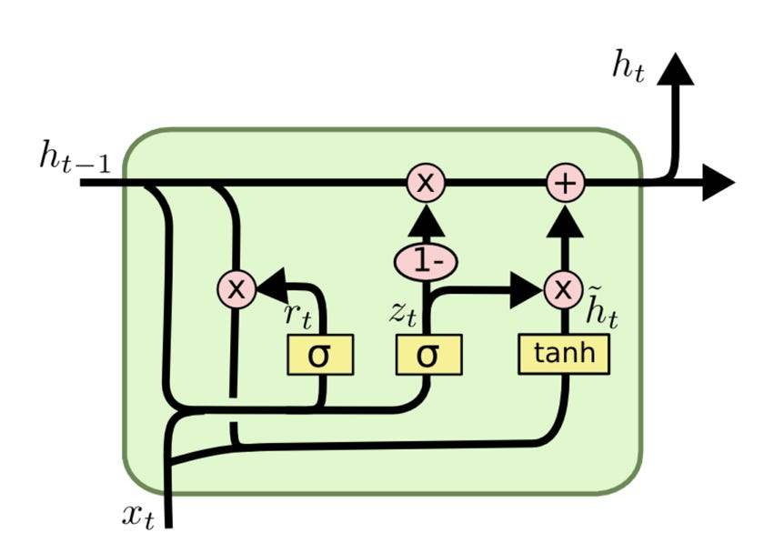
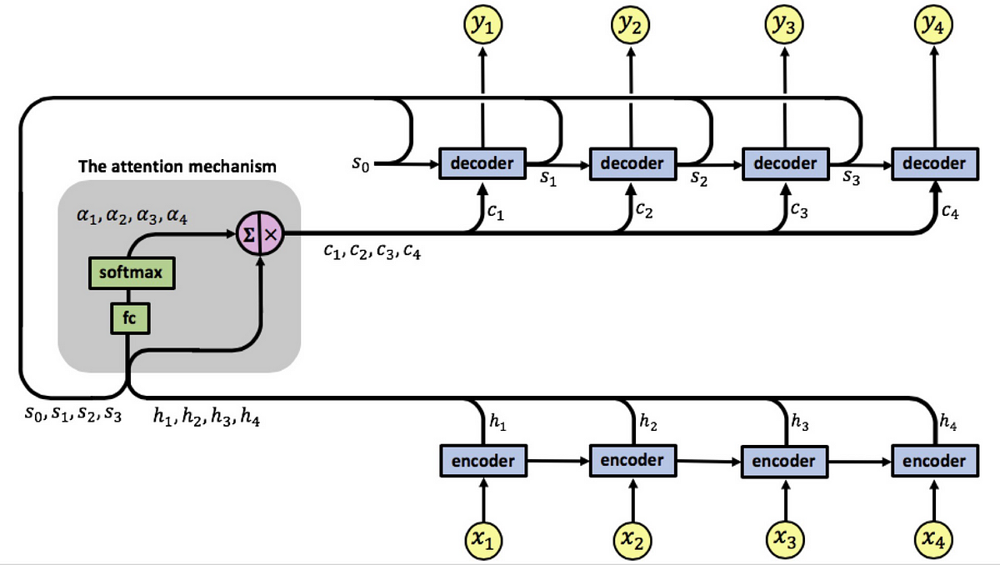

---
title:  "GRU & Attention"
metadate: "hide"
date : 2023-11-19 16:00:00 +0900
categories: [ ML/DL ]
image: "/assets/images/gru&attention.png" 
---  
**GRU**

LSTM 셀에는 internal state와 external state가 있고 input gate, forget gate, output gate가 있다. 게이트 순환 유닛(GRU, gated recurrent unit)이라는 비슷한 유형의 셀이 2014년에 개발되어 gradient vanishing/exploding 문제를 효과적으로 처리하면서 Long Term Dependency를 학습했다.

GRU에는 하나의 상태와 reset gate(input gate와 forget gate의 조합)와 update gate가 있다.



**Gated Orthogonal Recurrent Units**

GRU 아이디어와 Unitary RNN의 결합. Unitary RNN은 gradient vanishing/exploding 문제를 해결하기 위해 unitary 행렬(직교 행렬)을 RNN의 hidden state loop 행렬로 사용하는 아이디럴 기반으로 만들어졌다. 경삿값이 벗어나면 hidden-hidden 가중치 행렬의 고윳값(eigenvalues)이 1에서 벗어나기 때문에 작동된다. 이로 인해 이 행렬은 경사 문제를 해결하기 위해 직교 행렬로 교체 됐다.

## GRU와 Attention 기반 모델

**GRU와 PyTorch**

GRU는 두 개의 게이트(리셋 게이트와 업데이트 게이트)와 하나의 은닉 상태 벡터로 구성된 일종의 메모리 셀이다. 구성 측면에서 GRU는 LSTM보다 단순하지만 경사가 폭발하거나 소실하는 문제를 처리하는 데 있어 똑같이 효과적이다.

GRU는 LSTM보다 훈련 속도가 빠르고 언어 모델링 같은 수많은 작업에서 훨씬 적은 훈련 데이터로 LSTM만큼 수행할 수 있다.

파이토치는 코드 한 줄로 GRU 계층을 인스턴스화하는 nn.GRU 모듈을 제공한다.
```python
self.gru_layer = nn.GRU(
  input_size, hidden_size, num_layer=2, dropout=0.8, bidirectional=True
)

```

**Attention 기반 모델**

Attention 개념은 우리 인간이 때에 따라, 또 sequence(text)의 어느 부분인지에 따라 주의(attention)을 기울이는 정도가 다르다는 점에 착안했다.

예를 들어 'Martha sings beautifully, I am hooked to ___ voice.'라는 문장을 완성한다면, 채워야 할 단어가 'her'라는 것을 추측하기 위해 'Martha'라는 단어에 더 주의를 기울인다. 반면, 우리가 완성해야 할 문장이 'Martha sings beautifully, I am hooked to her ___.'라면 채워야 할 단어로 'voice', 'songs', 'sining' 등을 추측하기 위해 단어 'sings'에 더 주의를 기울일 것이다.

모든 recurrent network 아키텍처에는 현 시간 단계에서 출력을 예측하기 위해 sequence의 특정 부분에 초점을 맞추는 메커니즘은 존재하지 않는다. 대신 RNN은 hidden state vector 형태로 과거 sequence의 요약만 얻을 수 있다.

이 아키텍처에서 전역 컨텍스트 벡터는 매시간 단계마다 계산된다. 이후 앞서 나온 모든 단어에 주의를 기울이는 것이 아니라 앞서 나온 k개 단어에만 주의를 기울이는 로컬 컨텍스트 벡터를 사용하는 형태로 아키텍처의 변형이 개발됐다.