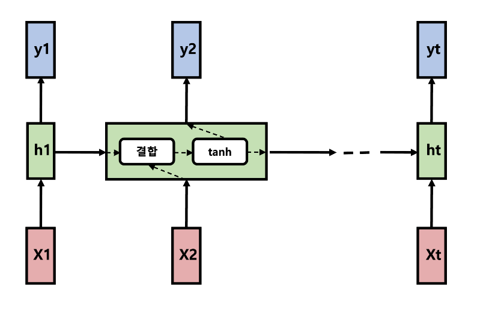
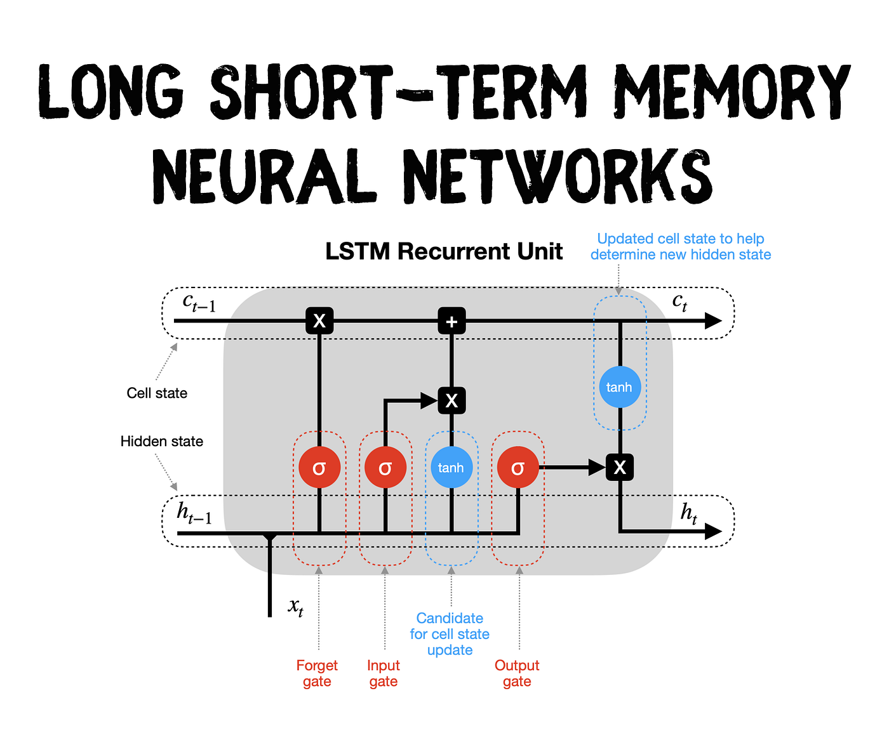

---
title:  "LSTM"
metadate: "hide"
date : 2023-11-19 15:00:00 +0900
categories: [ ML/DL ]
image: "/assets/images/lstm.png" 
---  
**LSTM**

- RNN은 순차 데이터를 다룰 수 있고 정보를 기억할 수 있지만, 경사가 폭발하거나 소실되는 문제를 안고 있다. 이 문제는 순환 신경망을 시간 축에 따라 펼치면 네트워크가 극단적으로 깊어지기 때문에 일어난다.

이 문제를 해결하기 위해 RNN 셀이 더 정교한 메모리 셀인 LSTM(Long-short term memory) 셀로 교체됐다.

RNN 셀에는 일반적으로 시그모이드(sigmoid)나 tanh 활성화 함수가 사용된다. 시그모이드 함수는 출력값을 0(보낼 정보 없음)과 1(보낼 정보 있음) 사이로 제어할 수 있으며 tanh 함수는 -1과 1 사이로 제어할 수 있다.

tanh는 출력값 평균이 0이고 일반적으로 경사가 크므로 학습(수렴) 속도를 빠르게 해줘서 더 유리한 점이 있다. 이 활성화 함수는 현재 시간 단계의 입력과 이전 시간 단계의 은닉 상태를 결합할 때 적용된다.




*RNN 셀*

time-unfolded RNN 셀에서 경사 항을 곱하기 때문에, 경삿값은 backpropagation되는 동안 RNN 셀에서 지속적으로 소실되거나 계속 증가한다. 따라서 RNN이 짧은 길이에서 순차적 정보를 기억할 수는 있어도 길이가 길어지면 곱셈이 많아져 기억하기 힘들어진다.

LSTM 계층은 다양한 time-unfolded LSTM셀로 구성된다. 정보는 하나의 셀에서 다른 셀로 셀 상태의 형태로 전달된다. 이 셀 상태는 게이트의 매커니즘을 통해 곱셈과 덧셈을 사용해 제어되거나 가공된다. 이 게이트는 이전 셀에서 오는 정보를 보존하거나 잊어버리면서 다음 셀로 흐르는 정보를 제어할 수 있다.


*LSTM network*

LSTMM은 훨씬 더 긴 순차 데이터를 효율적으로 다룰 수 있다는 점에서 RNN에 혁신을 일으켰다.

**stacked LSTM**

단일 계층의 LSTM 네트워크에서도 경사가 소실되거나 폭발하는 문제를 극복하는 것 같지만, LSTM 계층을 여러 개 쌓으면 음성 인식처럼 다양한 순차 처리 작업에서 상당히 복잡한 패턴을 학습하는 데 더 많은 도움이 된다.

LSTM셀은 본래 LSTM 계층을 시간 차원으로 쌓은 것이다. LSTM 계층을 공간 차원에서 몇 개 쌓으면 공간상에 필요한 추가적인 깊이를 제공하게 된다.

이 모델의 단점이라면 깊이가 늘어나고 순환 연결이 늘어나서 훈련 속도가 상당히 느리다는 것이다. 또한, LSTM 계층이 추가되면 모든 train iteration에서 시간 차원으로 펼쳐져야 한다. 따라서 여러 겹 쌓인 순환망 모델을 훈련 시키는 것은 일반적으로 병렬 수행이 불가능하다.

## 양방향 LSTM 만들기

LSTM은 시간 단계상 몇 단계 전이라도 중요한 정보는 보존하고 최근 정보라도 관련 없는 정보는 망각하는 데 도움이 되는 메모리 셀 게이트 덕분에 더 긴 시퀸스를 더 잘 처리할 수 있다. 경사가 폭발하거나 소실하는 문제를 확인하고 긴 영화 리뷰를 처리할 때 LSTM의 성능이 더 좋다.

또한, 모델이 영화 리뷰의 감성에 대해 좀 더 정보에 입각한 결정을 내릴 수 있게 언제든지 컨텍스트 윈도를 확장할 수 있도록 양방향 모델을 사용할 것이다.
```python
class LSTM(nn.Module):
    def __init__(self, vocabulary_size, embedding_dimension, hidden_dimension, output_dimension, dropout, pad_index):
        super().__init__()
        self.embedding_layer = nn.Embedding(vocabulary_size, embedding_dimension, padding_idx = pad_index)
        self.lstm_layer = nn.LSTM(embedding_dimension,
                           hidden_dimension,
                           num_layers=1,
                           bidirectional=True,
                           dropout=dropout)
        self.fc_layer = nn.Linear(hidden_dimension * 2, output_dimension)
        self.dropout_layer = nn.Dropout(dropout)

    def forward(self, sequence, sequence_lengths=None):
        if sequence_lengths is None:
            sequence_lengths = torch.LongTensor([len(sequence)])

        # sequence := (sequence_length, batch_size)
        embedded_output = self.dropout_layer(self.embedding_layer(sequence))


        # embedded_output := (sequence_length, batch_size, embedding_dimension)
        if torch.cuda.is_available():
            packed_embedded_output = cuda_pack_padded_sequence(embedded_output, sequence_lengths)
        else:
            packed_embedded_output = nn.utils.rnn.pack_padded_sequence(embedded_output, sequence_lengths)

        packed_output, (hidden_state, cell_state) = self.lstm_layer(packed_embedded_output)
        # hidden_state := (num_layers * num_directions, batch_size, hidden_dimension)
        # cell_state := (num_layers * num_directions, batch_size, hidden_dimension)

        op, op_lengths = nn.utils.rnn.pad_packed_sequence(packed_output)
        # op := (sequence_length, batch_size, hidden_dimension * num_directions)

        hidden_output = torch.cat((hidden_state[-2,:,:], hidden_state[-1,:,:]), dim = 1)
        # hidden_output := (batch_size, hidden_dimension * num_directions)

        return self.fc_layer(hidden_output)
```