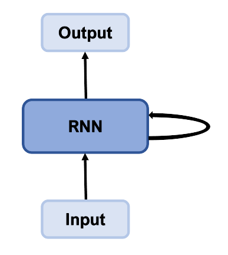
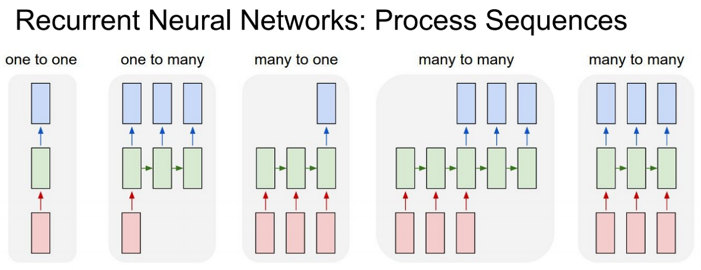

---
title:  "RNN"
metadate: "hide"
date : 2023-11-19 14:00:00 +0900
categories: [ ML/DL ]
image: "/assets/images/rnn.png" 
---  

CNN은 각 입력 X가 다른 입력에 독립적이며, 각 출력 y가 데이터셋의 다른 출력과 독립적인 X와 y 사이 1:1 매핑을 학습한다.

RNN에서는 X(혹은 y)가 단일의 독립 데이터 포인트뿐 아니라 데이터 포인트의 시간 순서 [X1, X2, ..Xt] (또는 [y1, y2, ..yt])인 순서를 모델링할 수 있다. X2(시간 단계 2에서 데이터 포인트)는 X1에 종속되고 X3는 X2와 X1에 종속되는 식이다.

이런 네트워크를 순환 신경망(RNN, Recurrent Neural Network)으로 분류한다. 이 네트워크는 네트워크에서 주기를 생성하는 모델에 추가적인 가중치를 포함해 데이터의 시간적 측면을 모델링할 수 있다. 이렇게 하면 다이어그램에서 보듯이 상태를 유지하는 데 도움이 된다.

주기(cycle)의 개념은 순환(recurrence)이라는 용어를 설명하고, 이 순환은 RNN에서 기억(memory)의 개념을 수립하는 데 도움이 된다. RNN에서는 숨겨진 내부 상태를 유지하면서 시간 단계 t에서 중간 출력을 시간 단계 t+1의 입력으로 쉽게 사용할 수 있다. 이러한 단계에 걸친 연결을 **순환 연결(recurrent connection)**이라고 한다.

## 순환 신경망의 발전

### 순환 신경망 유형

- One to One : ex. 이미지 분류(이미지 픽셀을 순차적으로 처리함으로서) (그다지 유용하지는 않다.)
- One to Many : ex. 이미지 캡션 생성: 이미지가 주어지면 이를 설명하는 문장/텍스트 일부를 생성한다.
- Many to One : ex. 감성 분석: 문장이나 일부가 주어졌을 때 긍정적인 표현인지, 부정적인 표현인지, 중립적인 표현인지 등을 분류한다.
- Many to Many(Incoder-Decoder) : ex. 기계 번역: 자연어로 된 문장/텍스트를 가져와 통합된 고정 크기의 표현으로 인코딩하고 해당 표현을 디코딩해 다른 언어로 된 같은 뜻의 문장/텍스트를 생성한다.
- Many to Many(Simultaneous) : ex. 명명된 개체 인식: 문장/텍스트가 주어지면 이름, 조직, 위치 등과 같이 명명된 개체 범주로 단어를 태깅한다.

*red : input, green : hidden layer, blue : output*

RNN의 막강한 특징 중 하나는 다양한 길이(t)의 순차 데이터를 다룰 수 있다는 것이다. 길이가 서로 달라도, 길이가 짧은 데이터에 패딩을 추가하고 길이가 긴 데이터는 잘라내는 방법으로 처리할 수 있다.

.png)
*t는 순차 데이터에서 전체 시간 단계의 수*

**BidirectionRNN**

- RNN이 순차 데이터에서 성능이 좋지만, 언어 변역 같은 일부 순서가 중요한 작업은 과거와 미래 정보를 모두 살펴봄으로써 더 효율적으로 수행할 수 있다. 예를 들어 영어 'I see you'를 프랑스어로 올바르게 번역하려면, 프랑스어로 두 번째와 세번 째 단어를 쓰기 전에 영어 세단어 모두를 알아야 한다.

양방형 RNN은 내부적으로 작동하는 RNN이 2개 있다. 하나는 처음부터 끝까지 순서대로 실행되고, 다른 하나는 끝에서 처음으로 가는 순서대로 실행된다.

> 해당 포스팅은 '실전! 파이토치 딥러닝 프로젝트'의 Ch04을 참고하여 작성되었습니다.