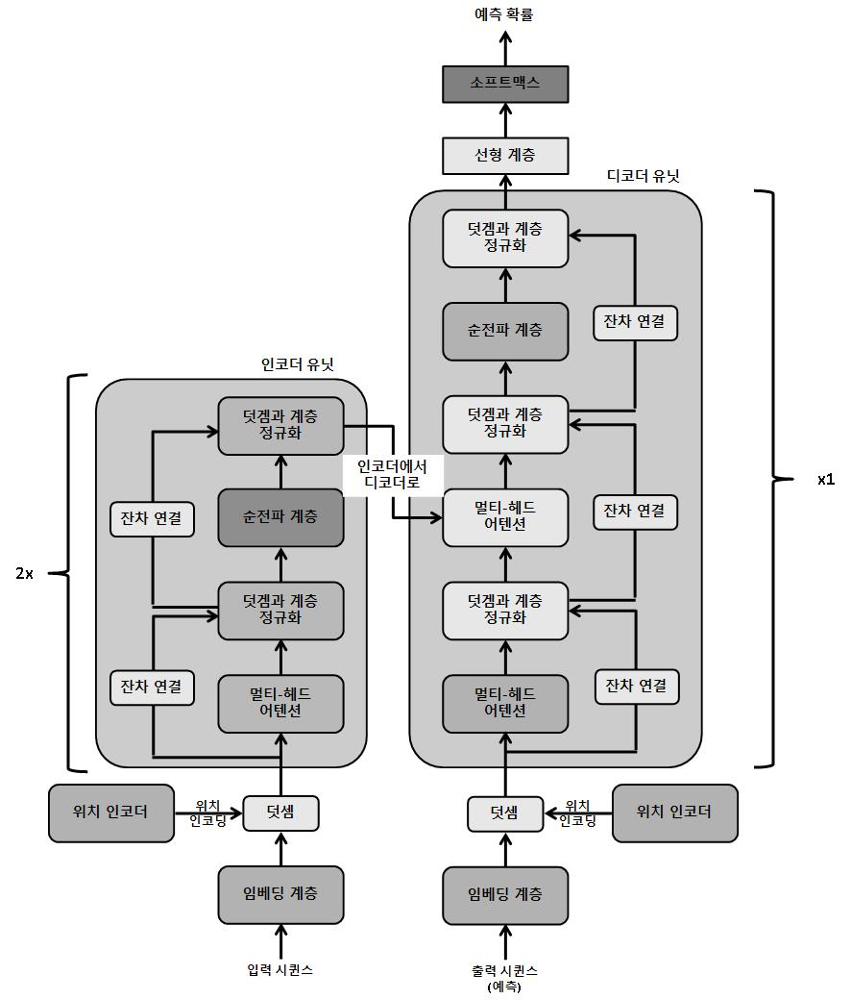
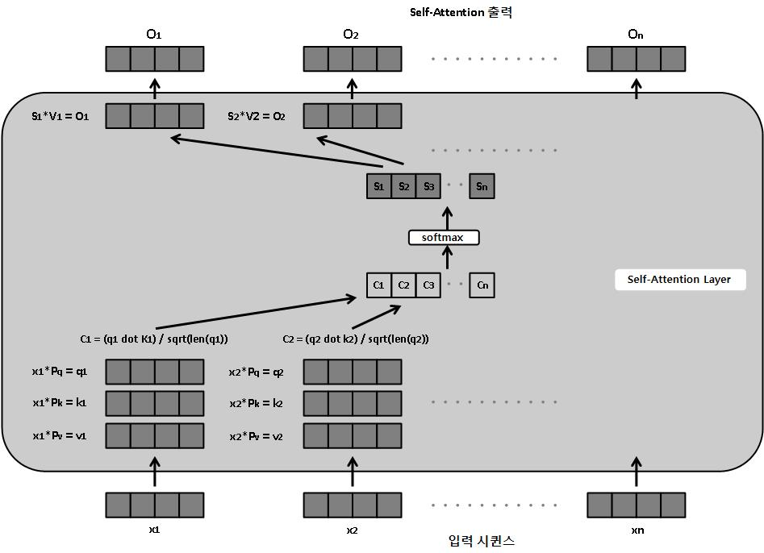
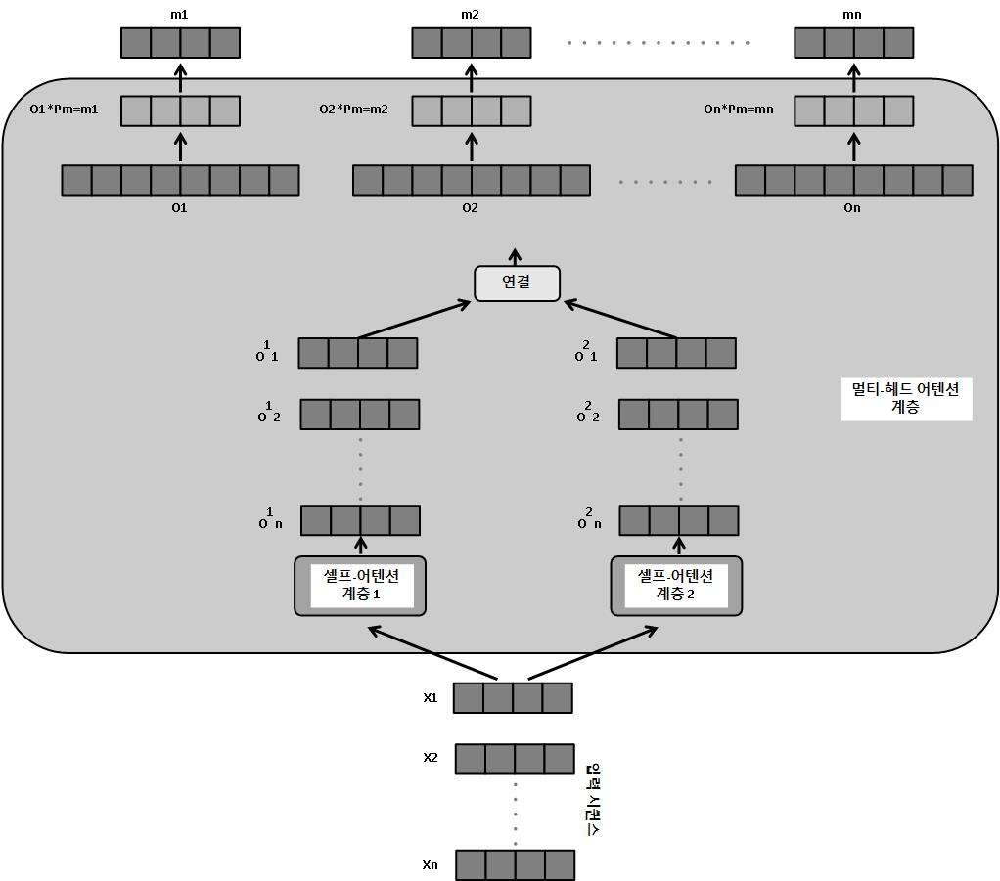

---
title:  "Transformer"
metadate: "hide"
date : 2023-11-19 18:00:00 +0900
categories: [ Concepts ]
image: "/assets/images/transformer.png" 
---  
## Transformer Model Architecture



Transformer 모델은 인코더-디코더 기반의 아키첵처 이다. 아키텍처가 깊어질수록 인코더와 디코더는 여러번 이어 붙일 수 있다. 이 그림에서는 2개의 인코더와 하나의 디코더로 구성되어 있다. 이 인코더-디코더 설정은 인코더가 시퀸스를 입력으로 가져와서 입력 시퀸스에 있는 단어 수만큼의 임베딩을 생성함(단어 하나 당 하나의 임베딩)을 뜻한다. 이 임베딩은 지금까지 모델에서 만들어진 예측과 함께 디코더에 제공된다.

- **임베딩 계층** : 이 계층은 임베딩, 즉 시퀸스의 각 입력 단어를 숫자 벡터로 변환하는 전형적인 작업을 수행한다. `torch.nn.Embedding` 모듈을 사용한다.
- **위치 인코더** : transformer 모델은 아키텍처에 순환 계층이 없지만, 시퀸스 작업에서 순환 네트워크보다 성능이 뛰어나다. 위치 인코딩(positional encoding)이라는 깔끔한 트릭으로 모델이 데이터의 순서에 대해 감을 잡을 수 있기 때문이다. 특정 순차 패턴을 따르는 벡터가 입력 단어 임베딩에 추가된다. 이러한 벡터는 모델에서 첫 번째 단어 뒤에 두번째 단어가 따라 나오는 것을 이해할 수 있게 하는 방식으로 생성된다. 벡터는 후속 단어 사이의 규칙적인 주기성과 거리를 나타내기 위해 각각 사인 곡선(sinusoidal) 함수와 코사인 곡선(cosinusoidal) 함수를 사용해 생성된다.

sin과 cos 함수는 순차 패턴을 제공하기 위해 번갈아 사용된다.

```python
class PosEnc(nn.Module):
    def __init__(self, d_m, dropout=0.2, size_limit=5000):
        # d_m is same as the dimension of the embeddings
        super(PosEnc, self).__init__()
        self.dropout = nn.Dropout(dropout)
        p_enc = torch.zeros(size_limit, d_m)
        pos = torch.arange(0, size_limit, dtype=torch.float).unsqueeze(1)
        divider = torch.exp(torch.arange(0, d_m, 2).float() * (-math.log(10000.0) / d_m))
        # divider is the list of radians, multiplied by position indices of words, and fed to the sinusoidal and cosinusoidal function
        p_enc[:, 0::2] = torch.sin(pos * divider) # 0, 2, 4 ...
        p_enc[:, 1::2] = torch.cos(pos * divider) # 1, 3, 5 ...
        p_enc = p_enc.unsqueeze(0).transpose(0, 1)
        self.register_buffer('p_enc', p_enc)

    def forward(self, x):
        return self.dropout(x + self.p_enc[:x.size(0), :])
```
*self-attention layer*

: self-attention layer는 attention 메커니즘이 자기 자신, 즉 시퀸스의 각 단어에 적용된다. 시퀸스의 각 단어 임베딩은 셀프-어텐션 계층을 통과해 단어 임베딩과 똑같은 길이의 개별 출력을 만들어 낸다.

각 단어에 대해 세 개의 벡터가 세 개의 학습 가능한 매개변수 행렬(Pq(query), Pk(key), Pv(value))를 통해 생성된다. query와 key 벡터를 스칼라곱(또는 점곱)하여 각 단어에 대한 숫자를 생성한다. 이 숫자를 각 단어의 키 벡터 길이의 제곱근으로 나누어 정규화한다. 모든 단어에 대해 결과 숫자에 소프트맥스 함수가 동시에 적용되어 확률을 생성하고, 이 확률에 마지막으로 각 단어의 value 벡터를 곱한다.

결과적으로 시퀸스의 각 단어에 대한 하나의 출력 벡터가 생성되는데 이때 출력 벡터의 길이는 입력 단어 임베딩과 동일하다.



- **멀티-헤드 어텐션** : 멀티-헤드 어텐션 계층은 여러 셀프-어텐션 모듈이 각 단어에 대한 출력을 계산하는 셀프-어텐션 계층의 확장판이다. 이 개별 출력을 연결하고 다른 매개변수 행렬(Pm)과 행렬 곱해서 입력 임베딩 벡터와 길이가 같은 최종 출력 벡터를 생성한다.

셀프-어텐션 헤드를 여러 개 두면 여러 개의 헤드가 시퀸스 단어의 다양한 관점에 집중하도록 도와준다. 이는 합성곱 신경망에서 여러 개의 특징 맵이 다양한 패턴을 학습하는 방법과 유사하다.

또한 디코더 유닛의 마스킹된 멀티-헤드 어텐션 계층은 마스킹이 추가됐다는 점을 제외하면 멀티-헤드 어텐션 계층과 똑같은 방식으로 작동한다. 즉, 시퀸스 처리의 시간 단계 t가 주어지면 t+1에서 n(시퀸스 길이)까지의 모든 단어가 마스킹(숨겨짐)된다.

훈련하는 동안 디코더에는 두 종류의 입력이 제공된다. 그중 하나는 최종 인코더에서 query와 key 벡터를 입력으로 받아 마스킹되지 않은 멀티-헤드 어텐션 계층으로 전달한다. 여기에서 이 query와 key 벡터는 최종 인코더 출력을 행렬로 변환한 것이다. 다른 하나는 이전 시간 단계에서 만들어진 예측을 입력으로 받아 마스킹된 멀티-헤드 어텐션 계층에 전달한다.


• **덧셈과 계층 정규화(Addition & Layer Normalization)** : Transformer 모델 아키텍처에서 Add & Norm 계층들 간에 Residual Connection이 있는 것을 볼 수 있다. 각 인스턴스에서 입력 단어 임베딩 벡터를 멀티-헤드 어텐션 계층의 출력 벡터에 바로 더함으로써 Residual Connection이 설정된다. 이렇게 하면 네트워크 전체에서 경사를 전달하기 더 쉽고 경사가 폭발하거나 소실하는 문제를 피할 수 있다. 또한 계층 간에 항등 함수를 효율적으로 학습하는데 도움이 된다.

게다가 계층 정규화는 정규화 기법으로 사용된다. 여기에서 각 특징이 독립적으로 정규화되어 모든 특징이 균등한 평균과 표준편차를 갖는다. 이러한 Add & Norm은 네트워크의 각 단계에서 시퀸스의 각 단어 벡터에 개별적으로 적용된다.

- **순전파 계층(Forward)** : 인코더와 디코더 유닛 모두에서 시퀸스의 모든 단어에 대해 정규화된 residual 출력 벡터가 공통 forward 계층을 통해 전달된다. 단어 전체에 공통 매개변수 세트가 있기 때문에 이 계층은 시퀸스 전체에서 더 광범위한 패턴을 학습하는 데 도움이 된다.
- **선형 및 소프트맥스 계층(Linear & Softmax)** : 지금까지 각 계층은 단어당 하나씩 벡터 시퀸스를 출력한다. Linear 계층은 벡터 시퀸스를 단어 사전의 길이와 똑같은 크기를 갖는 단일 벡터로 변환한다. 소프트맥스 계층은 이 출력을 확률 벡터(확률 벡터의 총합은 1)로 변환한다. 이 확률은 사전에서 각 단어가 시퀸스의 단어로 등장할 확률을 의미한다.

**Define Transformer Model with PyTorch**
```python
class Transformer(nn.Module):
    def __init__(self, num_token, num_inputs, num_heads, num_hidden, num_layers, dropout=0.3):
        super(Transformer, self).__init__()
        self.model_name = 'transformer'
        self.mask_source = None
        self.position_enc = PosEnc(num_inputs, dropout)
        layers_enc = TransformerEncoderLayer(num_inputs, num_heads, num_hidden, dropout)
        self.enc_transformer = TransformerEncoder(layers_enc, num_layers)
        self.enc = nn.Embedding(num_token, num_inputs)
        self.num_inputs = num_inputs
        self.dec = nn.Linear(num_inputs, num_token)
        self.init_params()

    def _gen_sqr_nxt_mask(self, size):
        msk = (torch.triu(torch.ones(size, size)) == 1).transpose(0, 1)
        msk = msk.float().masked_fill(msk == 0, float('-inf'))
        msk = msk.masked_fill(msk == 1, float(0.0))
        return msk

    def init_params(self):
        initial_rng = 0.12
        self.enc.weight.data.uniform_(-initial_rng, initial_rng)
        self.dec.bias.data.zero_()
        self.dec.weight.data.uniform_(-initial_rng, initial_rng)

    def forward(self, source):
        if self.mask_source is None or self.mask_source.size(0) != len(source):
            dvc = source.device
            msk = self._gen_sqr_nxt_mask(len(source)).to(dvc)
            self.mask_source = msk

        source = self.enc(source) * math.sqrt(self.num_inputs)
        source = self.position_enc(source)
        op = self.enc_transformer(source, self.mask_source)
        op = self.dec(op)
        return op
```
언어 모델링 작업의 경우 단어 시퀸스를 입력으로 받아 단일 출력만 내면 된다. 이 때문에 디코더(`self.dec`)는 인코더의 벡터 시퀸스를 단일 출력 벡터로 변환하는 선형 계층일 뿐이다.