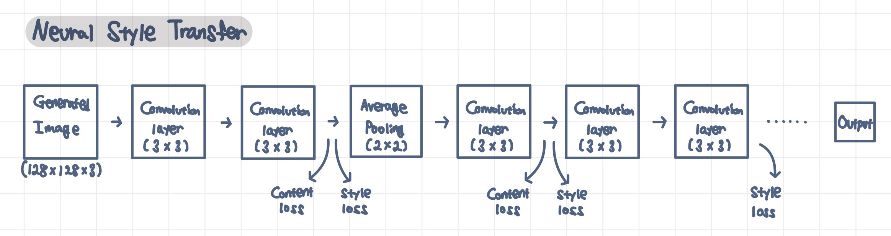

---
title:  "Neural Style Transfer"
metadate: "hide"
date : 2023-12-07 18:00:00 +0900
categories: [ Concepts ]
image: "/assets/images/neural-style-transfer.png" 
---  

https://arxiv.org/abs/1508.06576

## Neural Style Transfer 신경망 스타일 전이

Style 이미지의 스타일을 Content 이미지에 옮겨 새로운 Output을 생성하는 것을 Neural Style Transfer이라고 한다.

Neural Style Transfer은 다음과 같은 과정으로 구현할 수 있다.

1. Content 이미지에서 content 특징을 추출한다
2. Style 이미지에서 style 특징을 추출한다.
3. Neural Style Transfer (Content 이미지의 content와 Style 이미지의 style을 포함한 이미지를 생성)

### Content 특징 추출

이미지 분류에서 좋은 성능을 내는 VGG 모델의 Convolution 부분을 사용해 이미지에서 content 관련 특징을 추출한다.

1. Convolution layer에서 나온 N개의 특징맵을 NxM 2차원 행렬로 표현한다.
    - 3x3의 단일 채널(흑백) 이미지를 출력 채널 개수(N)이 3이고, kernel 크기는 (2,2), stride는 (1,1), padding은 없을 때, 이 convolution layer는 크기가 2x2(X x Y)인 3(N)개의 feature map을 만든다.
    - 이 feature map을 N x M (M = X x Y)인 2차원 행렬로 축소시킬 수 있다.
2. loss function은 Content loss (2차원 행렬로 표현한 정답 이미지 값과 2차원 행렬로 축소한 예측 행렬값 사이 픽셀 단위 손실의 제곱합)로 정의한다.

### Style 특징 추출

이미지에서 style을 추출하기 위해 축소된 2차원 행렬의 gram matrix(2차원 행렬 간 내적)를 구한다. N x X x Y(feature map 개수 x height x width)로 나누어 normalization한다.

content loss에 gram matrix 계산이 추가되었고, content loss에 비해 squared error가 상당히 크기에, 이를 

### Neural Style Transfer

Neural Style Transfer는 다음과 같이 작동한다.

1. VGG(또는 CNN) 네트워크의 어느 convolution layer의 output에서 content loss와 style loss를 계산할 것인지를 정해 모델의 아키텍처를 정의한다.
2. 생성된 Content 이미지를 네트워크에 전달하여 content loss를 계산하는 convolution layer에서 prediction 이미지의 2차원 행렬을 계산해, content loss를 구한다.
3. Style 이미지를 네트워크에 전달하여 convolution layer에서 prediction 이미지의 gram matrix를 계산해, style loss를 구한다.
4. 랜덤 노이즈 행렬 혹은 content 이미지를 초기 생성 이미지로 사용하여 content loss와  style loss를 구해 각각 합하여, 이 두 loss를 weighted sum하여 전체 loss를 구한다. Style loss에 더 많은 weight를 부여하면, output 이미지에 style 이미지의 style이 더 많이 반영된다.
5. 훈련을 반복할 수록, 모델은 content loss와 style loss를 최소화하는 방향으로 학습되어 style이 transfer된 이미지를 만들어낸다.

Pooling layer에서 일반적으로 사용하는 max pooling 대신 average pooling을 적용하여, style transfer에서 이미지 픽셀 간 gradation이 부드럽게 이어지도록 하였다. 