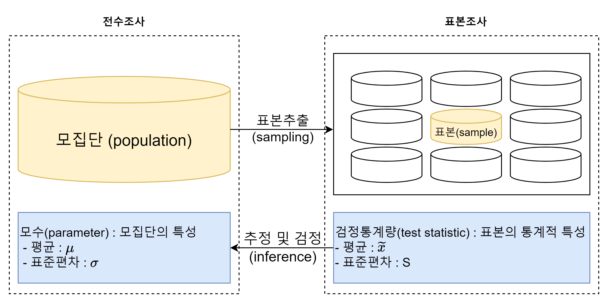
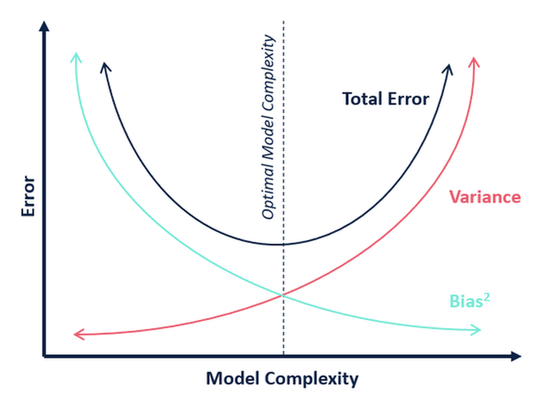

---
title:  "Statistics Basic (1)"
date : 2024-01-14 18:00:00 +0900
categories: [ Concepts]
image: "/assets/images/statistics-basic-(1).png" 
---  
## 편향과 표본추출

### 기술 통계와 추론 통계

**기술 통계**에서 '기술'은 'descriptive'를 의미한다. 즉, 기술 통계는 주어진 데이터의 특성을 사실에 근거하여 설명하고 묘사하는 것을 말한다. 예를 들어 A반 학생들의 키를 설명할 때, 모든 값들을 나열하 는 것이 아닌, 평균 키로 설명하는 것이다.
데이터의 특성을 설명하는 대표적인 방법은 대푯값(평균, 중앙값, 최빈값 등)을 설명하는 것이다. 이 외에도 데이터 각각의 값이 퍼져있는 정도, 최댓값과 최솟값의 범위 등을 설명할 수도 있다.
이렇게 기술 통계를 내는 것을 데이터 과학에서는 EDA(Exploratory Data Analysis, 탐색적 데이터 분석)이라고 한다. EDA의 과정을 통해 데이터를 유의미한 정보로 바꿀 수 있다.
기술 통계는 주로 산점도, 박스 플롯, 히스토그램과 같은 방법으로 데이터를 시각화하여 정보를 효과 적으로 전달한다.

**추론 통계**에서의 '추론'은 'inferential'을 의미한다. 추론 통계는 기본적으로 표본 집단으로부터 모집단의 특성을 추론하는 것이 목적이다. 예를 들어, 한 학급의 키에 관한 통계치를 통해 학교 전체 학생 키의 통계치를 추정하는 것이다.
추론 통계는 표본으로 구한 통계값을 통해 모집단의 모수(parameter) 값(내가 알고자 하는 값)이 얼 마인지, 모수 값이 특정 구간 내에 존재할 확률이 얼마인지를 추정하는데 사용된다.

### 모집단과 표본, 전수조사와 표본조사

**모집단(population)**은 분석하고자 하는 대상 전체의 집합을 말한다. 모집단의 부분집합, 즉 모집단의 일부를 추출한 것을 **표본(sample)**이라 한다.
모집단의 데이터 전세를 조사 및 분석하여 정보를 추출하는 것을 **전수조사**라고 하며, 모집단에서 추출 한 표본을 통해 모집단의 정보(평균, 표준편차 등)를 추정하고 검정하는 것을 **표본조사**라한다.

최종 분석에는 전체 데이터를 사용하더라도, 분석 모델이 완성될 때까지는 표본 데이터를 활용하는 것 이 경제적, 시간적으로 유리하다. 따라서, 예측 및 분류 모델링 단계에서는 적절한 표본을 추출해서 진 행하고 전체 프로세스가 완성됐을 때 전체의 데이터를 사용하여 최종적인 모델 성능을 확인하고 예측 및 분류를 하는 것이 좋다.

### 편향

표본추출에서 자연적으로 발생한 모집단과 표본의 차이를 **표본 오차(sampling error)**라고 한다. 즉, 같은 크기 두 개의 표본을 주의해서 추출한다고 해도 완전히 동일한 표본을 얻는 것은 불가능하기에 발생하는 오차이다.
표본 오차를 제외한 변동을 **비표본 오차(non-Sampling error)**라고 한다. 조시원의 미숙이나 지료의 그릇된 해석이 한 가지 원인이 된다. 대표적인 비표본 오차의 한 원인은 바로 **편향(bias)**이다.
편향은 표본에서 나타나는 모집단과의 체계적인 차이다. 대표적으로, 표본추출편향(sample selection bias), 가구편향(household bias), 무응답편향(non-response bias), 응답편향(response bias) 이 있다.
이러한 표본 편향은 확률(randomization) 등이 방법을 통해 최소화하게나 없앨 수 있다. 확률화란 모집단으로부터 편향이 발생하지 않는 표본을 추출하는 방법을 의미한다. 이렇게 추출한 표본을 확률 표본(random sample)이라 한다.

**인지적 편향 Cognitive Bias**
사람들은 언제나. 합리적으로 생각하고 행동하는 것이 아니며, 휴리스틱(heuristic)을 통해 왜곡된 지각으로 결정을 하는 경우가 많다.
분석가의 성향이나 상황에 따라 비논리적인 추론을 내리는 패턴을 인지적 편향(Cognitive Bias)이라고 한다.
인지적 편향에는 대표적으로 다음과 같은 5가지의 편향이 존재한다.

- **확증 편향 Confirmation Bias**
확증편향은 자신이 본래 믿고 있는 대로 정보를 선택적으로 받아들이고 임의로 판단하는 편향을 말한다.
확증 편향으로 인해 데이터 분석 시 자신의 판단에 대한 확신을 더해주는 방향으로만 데이터를 조정 하기도 하는데, 데이터 분석가들 말로는 이를 소위 '데이터를 마사지한다'라고 표현한다.
이를 해결하기 위해서 두 명 이상의 분석가가 크로스 체크를 하거나, 블라인드 분석을 수행할 수 있다.
- **기준점 편향 Anchoring Bias**
기준점 편향은 분석가가 가장 처음에 접하는 정보에 지나치게 매몰되는 편향이다. 처음 표본을 통해서 나왔던 통계가 머릿 속에 각인되어, 다른 분석 결과를 무시하거나 과소평가하는 것이다.
연봉 협상 시, 처음 제안 받는 금액이 기준점으로 자리잡는 현상도 기준점 편향이 적용된 현상이다.
- **선택 직원 편향 Choice-Supportive Bias**
선택 지원 편향은 본인이 의사결정을 내리는 순간 그 선택의 긍정적인 부분에 대해 더 많이 생각하고 그 결정에 반대되는 증거를 무시하게 되는 편향이다.
확증 편향은 기존의 상식과 고정관념을 바탕으로 정보를 선택적으로 수용하는 반면 선택 지원 편향은 주어진 정보들을 바탕으로 의사결정이 내려진 순간부터 편향성을 가진다는 차이가 있다.
- **분모 평향 Denominator Bias**
분모 편향은 분수 전체가 아닌 분자에만 집중하여 현황을 왜곡하여 판단하게 되는 편향이다.
역사적으로 사망자가 가장 많았던 전쟁을 뽑자면 7천만~1억명이 사망한 제2차 세계대전을 뽑을 수 있다. 하지만, 8세기 중국에서 발생한 안산의 난'의 사망자는 4천만명으로, 당시 세계 인구수 대비 15%가 사망했지만 제2차 세계대전은 세계인구수 대비 4%가 사망했으므로 안산의 난이 더 치명적인 전쟁이라 할 수 있다.
- **생존자 편향 Survivorship Bias**
생존자 편향은 소수의 성공한 사례를 일반화된 것으로 인식함으로 써 나타나는 편향이다. 대표적인 예시로는 유명한 [제2차 세계대전 사례](https://www.andrewahn.co/silicon-valley/survivorship-bias/)가 있다.

**머신러닝에서의 편향과 분산**

머신러닝에서 **편향**은 예측값들이 정답과 일정하게 차이가 나는 정도를 의미하며, **분산**은 주어진 데이터 포인트에 대한 모델 예측의 가변성을 뜻한다.

즉, 모델의 예측값과 정답값의 차이가 클 수록 편향은 크며, 모델의 예측값이 일정하지 않고 변동성이 클수록 분산이 크다라고 표현한다.

편향과 분산은 **trade-off** 관계에 있다. 예측이나 분류 모델을 만들 때 주어진 학습 데이터에 잘 맞도록 모델을 잘 만들면 편향은 줄어들고 분산은 증가할 수 밖에 없다. 즉, 모델의 복잡도가 상승할수 록 편향은 감소하지만 분산은 증가한다.

모델의 정확도 뿐만 아니라 비용, 정확도의 가치 등을 종합적으로 평가한 전체 에러를 고려하여 최적 의 모델을 만들어야한다.

### 표본 추출

표본추출은 두 가지 관점으로 바라볼 수 있다.

1. 데이터 수집 단계의 표본추출은 표본을 구하는 상황에서의 표본추출이다. 주로 통계서적에서의 표본 추출 과정은 이러한 과정을 말한다.
2. 데이터 분석 측에서는 기존의 빅데이터(기업의 데이터나 인터넷 데이터)에서 분석 모델링을 위한 적절한 크기의 표본데이터를 추출하는 것을 말한다.

기업의 데이터 분석 실무에서는 2번과 같은 상황의 표본추출을 하게 되는 경우가 더 많다,

데이터 수집 단계의 표본추출은 다음과 같은 단계로 구성된다.

**1. 모집단 확정**

- 조사대상이 되는 사람, 사물, 조직, 지역 등의 전체 집합을 구체적으로 정의

**2. 표본 프레임 결정**

- 모집단에 포함되는 조사 대상의 목록 설정

**3. 표본 추출방법 결정**

- 확률표본추출과 비확률표본추출, 복원과 비복원 추출 중 적절한 방법 선택

**4. 표본크기 결정**

- 조사의 유형, 시간, 예산 등을 고려하여 추출할 표본의 크기를 결정

**5. 표본추출**

- 선정된 조사대상들을 추출

거의 대부분의 경우에 표본 추출방법으로 **확률 표본(random sample) 추출방법**을 사용한다. 확률 표본추출방법은 데이터가 랜덤으로 추출될 확률을 알 경우 사용할 수 있으며, 표본의 통계량을 통해 모 집단의 모수에 대한 추론이 가능하며, 편향을 최대한 제거할 수 있어 표본의 신뢰도가 높다.

데이터 수집단계의 표본추출의 경우에는 표본프레임 설정이 어렵기 때문에 확률 표본추출방법을 사용할 수 없을 수도 있지만, 보유 데이터에서 표본을 추출할 경우 확률 표본추출방법을 사용한다. 대표적으로 다음과 같은 방법들이 있다.

- **단순 임의 추출방법 Simple Random Sampling Method**
모집단의 모든 구성단위가 표본으로 선정될 확률이 동일할 때 무작위로 추출하는 방법이다. 모집단에 대한 사전지식이 없는 경우에 유용한 방법으로 쉽고 빠르며 가장 일반적으로 쓰이는 방법이다. 제비뽑기나 로또 당첨 번호 선정과 같은 경우에 쓰이는 방법이다.
- **계층적 표본추출방법 Hierarchical Sampling Method**
모든 구성단위에 번호를 부여한 뒤, 일정한 간격으로 표본을 선택하는 방법이다. 예를 들어 1,000개의 모집단에서 100개의 표본을 추출하는 경우, 모집단에 1부터 1,000까지 번호를 부여한 뒤, 10개의 간격으로 (10번 데이터, 20번 데이터, 30번 데이터... 1,000번 데이터) 표본을 추출한다. 이 방법은 모집단 에서 등간격으로 표본이 공평하게 추출되는 장점이 있지만, 모집단의 배열에 일정한 주기성이 있는 경우, 표본의 대표성이 결여될 수 있다.
- **층화 표본추출방법 Stratified Sampling Method**
모집단이 특정한 기준으로 분류가 가능할 때, 모집단을 특정 기준에 따라 소집단(strata)으로 나눈 뒤 각 소집단에서 일정수의 표본을 추출한다.
이 방법은 모집단에 대한 사전지식과 분류 기준에 대한 충분한 근거가 필요하며, 표본을 단순 임의로 추출하였을 때 표본이 편중될 수 있는 위험을 보완한다.
- **군집 표본추출방법 Cluster Sampling Method**
이 방법은 모집단을 특정한 기준으로 분류한 뒤, 그 중 하나의 소집단을 선택하여 분석하는 방법이다.
하나의 소집단을 선정한 뒤, 소집단 전체 혹은 일부를 표본추출한다.
이 방법은 모집단이 방대하여 표본추출이 쉽지 않을 때 유용하다. 다만, 특정 기준으로 분류된 하나의 소집단만을 표본으로 하기에 모집단의 모수를 반영하지 못할 수 도 있다.
추출했던 표본을 원래의 모수에 복원시켜서 다시 추출하는지의 여부에 따라 복원추출과 비복원추출로 구분할 수 있다.
- **복원추출법 Sampling With Replacement : SWR**
처음 모집단에서 추출된 표본을 되돌려 넣고 다음 표본을 추출하는 방법이다. 이 방법은 동일한 표본 이 중복으로 추출될 수 있으며, 표본을 뽑은 후 다시 모집단을 복원시키기 때문에 표본공간은 독립적 으로 변화가 없다. 즉, 모집단에서 A라는 표본을 뽑았다고 해서, 다음 추출때 A라는 표본이 추출될 확 률에는 변화가 없다.
- **비복원추출법 Sampling WithOut Replacement: SWOR**
모집단에서 추출된 표본을 되돌려 넣지 않고 다음 표본을 추출하는 방법이다.
따라서 표본을 추출하는 행위는 표본공간을 바꾸는 종속사건이 되어, 표본을 추출하는 행위는 다음 표 본들의 추출 확률에 영향을 미친다.

일반적으로 모집단에 비해 추출하려는 표본의 양이 작으면 복원 추출이나 비복원 추출의 차이는 거의 없다. 하지만 모집단의 크기가 크지 않거나, 추출하려는 표본이 모집단의 20% 이상인 경우에는 복원 추출 방식이 편향을 더 줄일 수 있다.
만약 10개의 관측치가 있는 모집단에서 표본 4개를 복원추출 할 경우, 가능한 순서표본의 개수는 $10\times10\times10\times10 = 10,000$. 하지만 비복원추출을 하는 경우 가능한 순서표본의 개수는 $10 \times 9 \times 8 \times 7_{10}P_4 = 5040$이 된다.