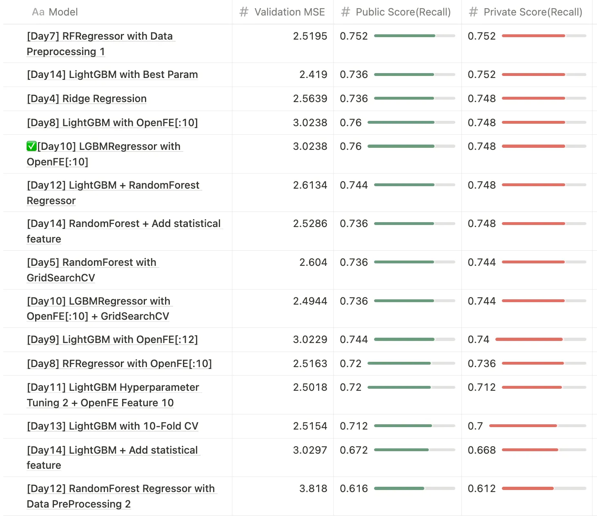

## 2024 Samsung AI challenge Black-box Optimization Review

### 대회를 돌아보며

2024 Samsung AI Challenge: Black-box Optimization에 참가했습니다. 이번 대회는 삼성전자 SAIT가 주관한 것으로, 반도체 공정과 같이 복잡한 블랙박스 문제에 대한 최적화 알고리즘을 개발하는 대회였습니다.

Black-box Optimization(블랙박스 최적화)란 목적 함수나 매개변수 간의 자세한 관계를 알 수 없는 최적화 문제를 말합니다. 대회에서 제공한 데이터는 각 변수의 의미를 알 수 없었고, $x_0, x_1, x_2,...,y$와 같이 표기된 변수들로 구성되어 있었습니다.

이번 대회를 진행하며 겪은 어려움은 크게 두 가지였습니다.

먼저, 앞서 언급했듯이 변수에 대한 정보가 제공되지 않아 도메인 지식을 이용해 데이터를 전처리할 수 없었습니다. 따라서 저는 Automated Feature Generation 라이브러리인 OpenFE를 이용하여 데이터를 증강하고, 실험을 통해 최적의 변수들을 추가했습니다.

또한, 대회의 평가 지표가 '예측(Pred) 상위 10% 중에서 실제(True) 상위 5%에 대한 Recall 계산'이었습니다. 회귀 문제라 MSE를 이용해 모델을 훈련시켰는데, 평가 지표는 Recall 점수여서 실험을 진행하며 꽤나 고민이 되었습니다. MSE로 학습과 평가를 진행하자니 제출한 결과물에 대한 Recal 점수와의 관계를 알 수 없었고, Recall 점수를 학습에 이용하기엔 부자연스럽다고 판단했습니다. 따라서 저는 MSE로 모델을 학습하고, MSE와 더불어 대회 평가지표와 동일한 Recall 계산 함수를 만들어 모델을 평가했습니다.

이번 대회에서는 Ridge, SVM, CNN, MLP, RandomForest, XGBoost, LightGBM 모델들과 StandardScaler, PowerTransformer, 이상치 탐지, OpenFE, GridSearchCV, K-Fold CV 방법들을 이용해 14일간 42번의 실험을 진행했습니다.

다음은 대회를 준비하며 진행한 실험 내용의 간략한 요약입니다.

### Baseline

Baseline으로 삼은 모델의 성능은 다음과 같습니다. Baseline 모델에는 간단히 StandardScaler를 적용한 데이터를 입력으로 사용했습니다.

| 모델 | MSE | 공개 점수(리콜) |
| --- | --- | --- |
| RandomForest | 2.7107 | 0.68 |
| XGBoost | 2.9453 | 0.672 |
| SVM | 2.8193 | 0.712 |
| CNN | 2.9566 | 0.696 |
| MLP | - | 0.736 |
| Ridge | 2.5639 | 0.736 |
| LightGBM | 3.2120 | 0.72 |

### 데이터 정규화(StandardScaler, PowerTransformer)

데이터 정규화 방식으로 StandardScaler와 PowerTransformer를 사용해 보았습니다. 입력 변수에 양수와 음수 데이터가 모두 포함되어 있어, 두 종류의 데이터를 모두 처리할 수 있는 PowerTransformer를 이용해 정규화를 시도했습니다. CNN에서는 StandardScaler보다 PowerTransformer를 적용한 것이 리콜 점수는 더 좋았지만, MSE 점수는 큰 차이가 없었습니다. SVM은 MSE 점수에서는 성능이 비슷했지만, Recall 점수에서는 오히려 더 낮은 점수를 보였습니다.

### XGBoost vs LightGBM

XGBoost는 대규모 데이터셋에서 상대적으로 메모리 사용량이 높아 매우 큰 데이터셋에서는 성능이 저하될 수 있습니다. 반면, LightGBM은 큰 데이터셋에서 매우 효율적으로 작동합니다.

이번 대회의 데이터셋은 규모가 컸기에, 부스팅 계열에서는 XGBoost보다 LightGBM을 위주로 실험해 보았습니다.

### GridSearchCV

최적의 모델 하이퍼파라미터를 찾는 방식으로 GridSearchCV를 사용했습니다. 기준선에서 준수한 성능을 보인 RandomForest, MLP, LightGBM 모델에 GridSearchCV를 적용했습니다.

| 모델 | MSE | Public Score(Private) |
| --- | --- | --- |
| RandomForest | 2.6040 | 0.736 |
| MLP | 2.5591 | 0.72 |
| LightGBM | 2.5927 | 0.712 |

### Outlier Detection

데이터의 각 변수와 타겟값의 분포를 산점도로 시각화한 결과, 소수의 뚜렷한 이상치가 발견되었습니다. 정규화 후 시각화를 하면 이상치가 더욱 명확하게 드러났습니다.

전체 데이터 중 이상치가 매우 소수라서 제거하는 게 성능에 큰 영향을 미칠지 의문이었습니다. 그러나 각 이상치가 성능에 상당한 영향을 미친다는 사실을 알게 되었습니다.

| 모델 | MSE | Public Score(Private) |
| --- | --- | --- |
| RandomForest | 2.5195 | 0.752 |
| MLP | 2.5932 | 0.704 |

### OpenFE

Automated Feature Generation 라이브러리인 OpenFE를 사용하여 추가 변수를 생성했습니다.

OpenFE로 새롭게 생성된 변수들을 중요도 순으로 정렬하여 원하는 수만큼 추가할 수 있습니다. 다양한 조합을 실험한 결과, 상위 변수 일부를 추가했을 때 가장 좋은 성능을 보였습니다.

| 모델 | MSE | Validation Reccall | Public Score(Private) |
| --- | --- | --- | --- |
| LightGBM | 3.0238 | 0.88 | 0.76 |

### Result

최종 결과는 Public 리더보드 3위, Private 리더보드 6위였습니다. 평가 방식이 recall 점수여서 동점자가 많았습니다. 흥미로웠던 점은 참가자들의 Public 리더보드와 Private 리더보드 순위 차이가 상당했다는 것입니다. Public 리더보드 공동 1위 팀들은 Private 리더보드에서 6위, 7위를 기록했고, Private 리더보드 1위 팀은 Public 리더보드에서 4위를 기록한 팀이었습니다.
대회 기간동안 Public 리더보드 기준 2등까지 달성했기에, Private 리더보드에서도 좋은 성적을 기록할 수 있찌 않을까 하는 기대감이 있었지만, 결과는 아쉬웠습니다.

대회를 진행하며 MSE값, Recall 점수, Public 및 Private 점수 간의 상관관계에 대한 의문이 남아, 대회를 다시 한번 분석해보기로 했습니다. 최종 제출본 외에는 비공개 점수가 공개되지 않고, 대회 종료 후 새로 제출한 결과물에 한해 Private 점수가 공개되었기에 의미있었던 결과물들의 Private 점수를 확인해보는 과정을 거쳤습니다. (기존의 실험 결과들을 따로 저장해두지 않아… 모든 코드를 다시 돌렸습니다 ㅠㅠ)

결과를 살펴보니, MSE값과 Recall 점수 간에 어느 정도 상관관계가 있어 보이지만, Public Recall 점수이 높다고 해서 Public Recall 값이 반드시 높은 것은 아니었습니다. 실제로 최종 제출본보다 Public 점수는 낮지만 MSE값이 높았던 결과물이 Private 점수에서 더 높은 성적을 거두었습니다. 

Validation MSE값을 기준으로 최종 결과물을 선정했어야 한다는 생각이 들었고, Public 리더보드에 너무 집착한 것 같아 아쉬움이 남았습니다.

### 더 나은 다음을 위해

이번 대회에서는 아쉽게도 수상하지 못했지만, 더 나은 다음을 위해 이번 대회를 되돌아보았습니다.

이번 대회에서는 다양한 모델과 방법을 실험해보았지만, 체계적으로 진행하지 않아 실험의 방향성이 명확하지 않았습니다. 다음 번에는 체계적으로 실험을 설계하여 보다 효율적으로 문제를 해결 해야겠다는 생각이 들었습니다.

또한, 문제 정의를 더욱 명확히 해야 한다는 점을 깨달았습니다. 이번 대회에서는 Public 점수에 집착했고, 모델의 평가 기준을 MSE값으로 할지, Recall 점수로 할지 명확히 하지 못해 방황하기도 하였습니다. 다음 번에는 문제의 평가 기준을 명확히 하고, 일관성 있게 실험을 진행해야겠다는 생각입니다.